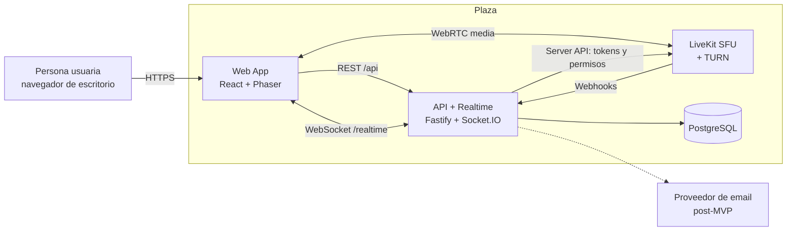
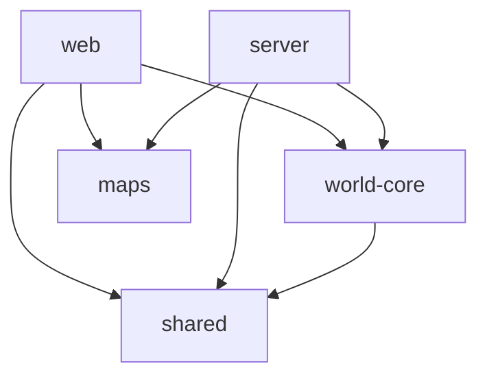
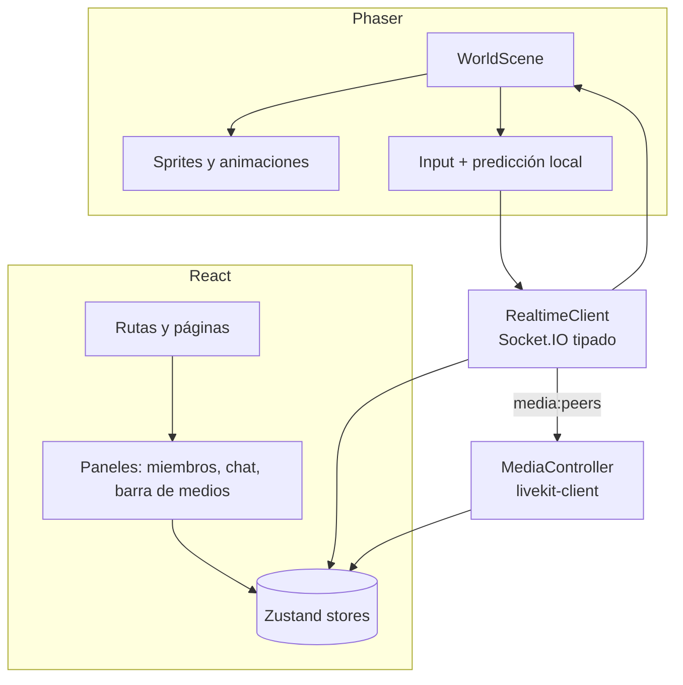
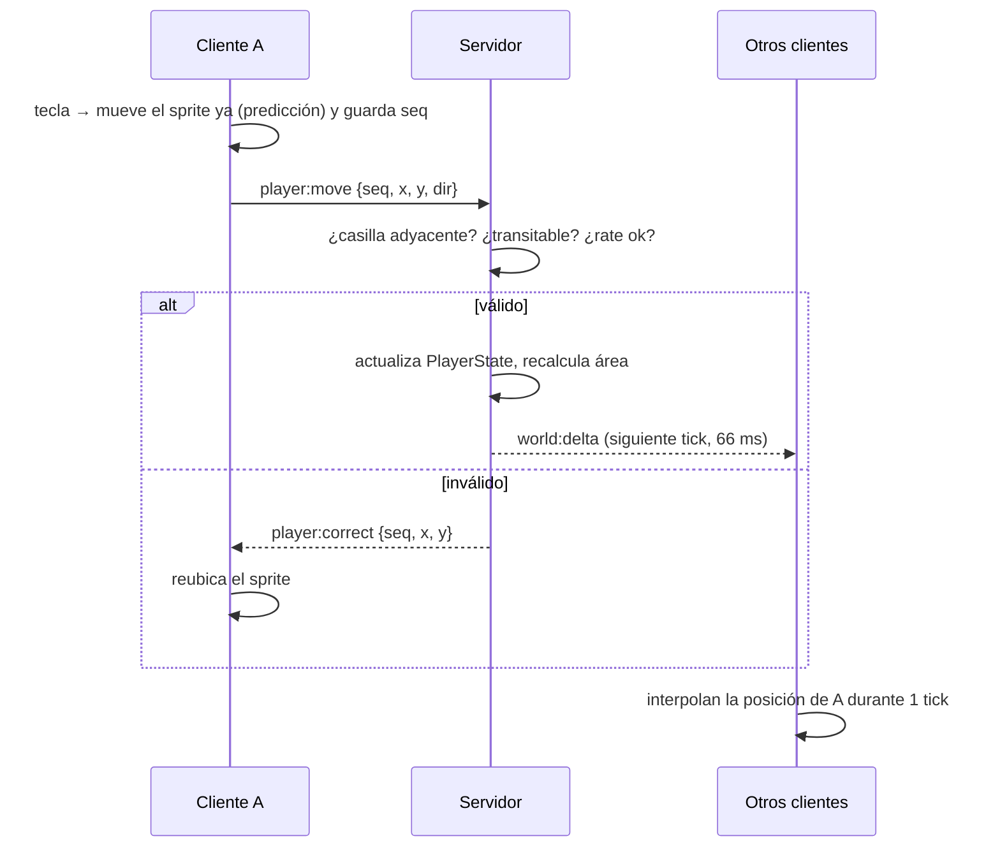
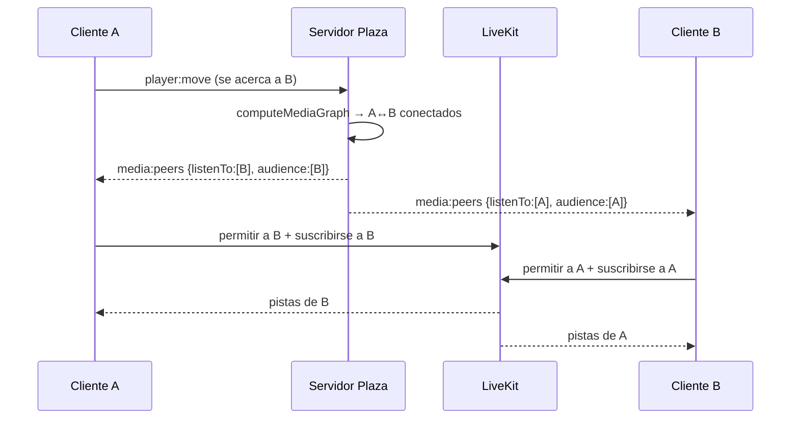

# 02 · Arquitectura — Plaza MVP

Este documento traduce el [brief](./01-brief-requerimiento.md) a una arquitectura concreta.
Cada decisión relevante tiene su ADR (sección 12) con alternativas y motivos.

---

## 1. Principios de arquitectura

1. **Un solo lenguaje, tipos compartidos.** TypeScript de punta a punta; los contratos (REST y
   tiempo real) se definen **una vez** con `zod` en un paquete compartido y se infieren los tipos.
2. **El servidor es la autoridad.** Posiciones, pertenencia a áreas privadas y quién puede oír
   a quién se decide en el servidor. El cliente predice para ser fluido, pero el servidor corrige.
3. **Lógica de dominio pura y reutilizable.** Colisiones, proximidad y áreas son funciones puras
   en un paquete (`world-core`) que usan tanto el cliente como el servidor, y se prueban sin red.
4. **Monolito modular primero.** Un único proceso backend con módulos bien separados; se puede
   partir más adelante sin reescribir (RNF-09).
5. **No reinventar los medios.** El audio/vídeo se delega a un SFU de código abierto (LiveKit).
6. **Privacidad por diseño.** Las áreas privadas se aplican en el SFU, no solo ocultando vídeos en la UI.

## 2. Vista de contexto (C4 nivel 1)



## 3. Vista de contenedores (C4 nivel 2)

| Contenedor | Tecnología | Responsabilidad |
|---|---|---|
| **web** (`apps/web`) | Vite, React 19, Phaser 3, Zustand, TanStack Query, Tailwind CSS, `livekit-client` | UI (login, espacios, paneles, barra de medios) y mundo 2D (render, input, predicción). |
| **server** (`apps/server`) | Node.js 22 LTS, Fastify 5, Socket.IO 4, Prisma, zod, pino, `livekit-server-sdk` | API REST, sesiones, estado vivo de cada espacio, validación de movimiento, motor de proximidad, emisión de tokens y permisos de medios, chat. |
| **livekit** | LiveKit Server (Go, imagen oficial) con TURN embebido | Reenvío de pistas de audio/vídeo/pantalla (SFU), simulcast, TURN/TLS. |
| **postgres** | PostgreSQL 16 | Usuarios, sesiones, espacios, membresías, invitaciones, chat. |
| **redis** *(opcional en MVP)* | Redis 7 | Reservado para escalar: adaptador de Socket.IO y estado de espacios compartido entre instancias. |

## 4. Estructura del monorepo

```text
plaza/
├── apps/
│   ├── web/                      # Frontend
│   │   └── src/
│   │       ├── app/              # router, providers, layout
│   │       ├── features/
│   │       │   ├── auth/         # login, registro, sesión
│   │       │   ├── spaces/       # lista, crear, invitaciones
│   │       │   ├── world/        # integración Phaser (escenas, sprites, input)
│   │       │   ├── media/        # LiveKit, pre-join, tiras de vídeo, pantalla
│   │       │   ├── presence/     # estados, lista de miembros, localizar
│   │       │   └── chat/         # chat del espacio y cercano, reacciones
│   │       ├── shared/           # ui kit, hooks, api client, i18n, utils
│   │       └── main.tsx
│   └── server/                   # Backend
│       ├── prisma/               # schema.prisma y migraciones
│       └── src/
│           ├── modules/
│           │   ├── auth/
│           │   ├── users/
│           │   ├── spaces/
│           │   ├── invitations/
│           │   ├── world/        # estado vivo, movimiento, proximidad, áreas
│           │   ├── media/        # tokens LiveKit, permisos, webhooks
│           │   ├── presence/
│           │   └── chat/
│           ├── platform/         # http, socket, db, logger, config, errores
│           └── main.ts
├── packages/
│   ├── shared/                   # contratos zod (REST + eventos), constantes, tipos
│   ├── world-core/               # lógica pura: grid, colisiones, proximidad, áreas
│   ├── maps/                     # mapas Tiled (.tmj), tilesets, manifest de plantillas
│   └── config/                   # tsconfig base, eslint, prettier
├── infra/
│   ├── docker-compose.yml        # postgres, livekit (+ redis opcional)
│   ├── livekit.yaml
│   └── Caddyfile                 # TLS y proxy en despliegue
├── e2e/                          # Playwright
├── .github/workflows/            # CI
├── package.json / pnpm-workspace.yaml / turbo.json
└── docs/
```

**Regla de dependencias entre paquetes:**



`world-core` y `shared` **no** dependen de React, Phaser, Node ni de ninguna librería de red.

## 5. Arquitectura del backend

### 5.1 Capas dentro de cada módulo

```text
modules/<modulo>/
├── <modulo>.routes.ts      # adaptador HTTP (Fastify): parsea con zod, llama al servicio
├── <modulo>.socket.ts      # adaptador Socket.IO (si aplica)
├── <modulo>.service.ts     # casos de uso / aplicación (orquesta, transacciones)
├── <modulo>.repository.ts  # acceso a datos (Prisma) detrás de una interfaz
├── <modulo>.domain.ts      # reglas puras del módulo (sin I/O)
└── __tests__/
```

- Los **adaptadores** (routes/socket) no contienen lógica de negocio.
- Los **servicios** reciben dependencias por constructor (inyección manual con un `container.ts`).
- El **dominio** no importa nada de infraestructura.

### 5.2 Módulos

| Módulo | Responsabilidad principal |
|---|---|
| `auth` | Registro, login, logout, sesiones en BD, middleware `requireUser` (HTTP y socket). |
| `users` | Perfil (nombre visible, avatar). |
| `spaces` | CRUD de espacios, membresías, roles, expulsión, asignación de escritorios. |
| `invitations` | Crear, aceptar y revocar enlaces de invitación. |
| `world` | Estado vivo de cada espacio en memoria (`SpaceRuntime`), validación de movimientos, *tick* de difusión, motor de proximidad y de áreas. |
| `media` | Emitir tokens de LiveKit, aplicar permisos de suscripción, procesar webhooks. |
| `presence` | Estados (Disponible/Ocupado/Ausente), conectados, "localizar". |
| `chat` | Mensajes del espacio (persistidos) y cercanos (efímeros), reacciones. |

### 5.3 Estado vivo de un espacio (`SpaceRuntime`)

```ts
// packages/world-core (tipos) + apps/server/src/modules/world (implementación)
interface PlayerState {
  userId: string;
  displayName: string;
  avatarId: string;
  x: number;               // casilla
  y: number;
  dir: 'up' | 'down' | 'left' | 'right';
  status: 'available' | 'busy';           // elegido por la persona
  activity: 'active' | 'tab-away' | 'idle'; // detectado por el cliente (RN-05)
  areaId: string | null;   // área privada actual (calculada por el servidor)
  onSpotlight: boolean;    // está en una casilla spotlight (RN-11)
  inConversation: boolean; // tiene ≥ 1 peer A/V → globo 💬 visible para todos
  lastSeq: number;         // último movimiento aceptado
}

interface SpaceStateStore {                 // interfaz sustituible por Redis (RNF-09)
  get(spaceId: string): SpaceRuntime | undefined;
  getOrLoad(spaceId: string): Promise<SpaceRuntime>;
  unloadIfEmpty(spaceId: string): void;
}
```

El `SpaceRuntime` se crea al entrar la primera persona (carga el mapa, construye la rejilla de
colisiones y el índice de áreas) y se descarta 60 s después de que salga la última.

## 6. Arquitectura del frontend



- **React** gestiona todo lo que es DOM: páginas, paneles, vídeos (`<video>`), formularios.
- **Phaser** gestiona solo el `<canvas>` del mundo: mapa, avatares, nombres, burbujas, cámara.
- **Comunicación React ⇄ Phaser:** a través de *stores* de Zustand (estado) y de un `EventBus`
  tipado (órdenes puntuales como "localizar a X"). Phaser nunca importa componentes React.
- **`RealtimeClient`:** único punto que habla con Socket.IO; valida los eventos entrantes con los
  esquemas zod de `@plaza/shared` y expone métodos tipados.
- **`MediaController`:** único punto que habla con LiveKit; recibe la lista de *peers* permitidos
  y sincroniza suscripciones y permisos.
- **Datos REST:** TanStack Query con un cliente `fetch` tipado a partir de los contratos compartidos.

## 7. Modelo de datos

```prisma
// apps/server/prisma/schema.prisma (extracto)
model User {
  id           String       @id @default(cuid())
  email        String       @unique
  passwordHash String
  displayName  String
  avatarId     String       @default("avatar-01")
  createdAt    DateTime     @default(now())
  sessions     Session[]
  memberships  Membership[]
}

model Session {
  id        String   @id            // hash SHA-256 del token de la cookie
  userId    String
  user      User     @relation(fields: [userId], references: [id], onDelete: Cascade)
  expiresAt DateTime
  createdAt DateTime @default(now())
  @@index([userId])
}

model Space {
  id            String       @id @default(cuid())
  name          String
  slug          String       @unique
  mapTemplateId String                   // referencia a packages/maps (p. ej. "office-small@1")
  ownerId       String
  createdAt     DateTime     @default(now())
  memberships   Membership[]
  invitations   Invitation[]
  messages      ChatMessage[]
}

enum Role { OWNER MEMBER }

model Membership {
  userId   String
  spaceId  String
  role     Role     @default(MEMBER)
  deskId   String?                        // id de objeto "desk" del mapa (RF-16)
  status   String   @default("available") // estado elegido: available | busy (RF-12)
  joinedAt DateTime @default(now())
  user     User     @relation(fields: [userId], references: [id], onDelete: Cascade)
  space    Space    @relation(fields: [spaceId], references: [id], onDelete: Cascade)
  @@id([userId, spaceId])
  @@unique([spaceId, deskId])
}

model Invitation {
  id          String    @id @default(cuid())
  spaceId     String
  tokenHash   String    @unique
  expiresAt   DateTime
  revokedAt   DateTime?
  createdById String
  uses        Int       @default(0)
  space       Space     @relation(fields: [spaceId], references: [id], onDelete: Cascade)
}

model ChatMessage {
  id        String   @id @default(cuid())
  spaceId   String
  authorId  String
  body      String   @db.VarChar(1000)
  createdAt DateTime @default(now())
  space     Space    @relation(fields: [spaceId], references: [id], onDelete: Cascade)
  @@index([spaceId, createdAt])
}
```

Las **posiciones no se guardan en BD** en el MVP (son efímeras). Solo se guarda el escritorio asignado.

## 8. Mapas

- Se diseñan en **Tiled** y se exportan como JSON (`.tmj`) en `packages/maps/templates/<id>/`.
- Convención de capas obligatoria (validada por un script en CI):

| Capa | Tipo | Uso |
|---|---|---|
| `floor` | tiles | Suelo (solo visual) |
| `decor-below` / `decor-above` | tiles | Decoración por debajo / encima de los avatares |
| `collision` | tiles | Cualquier tile ≠ 0 bloquea el paso |
| `areas` | objetos (rectángulos/polígonos) | Áreas. Propiedades: `areaId`, `name`, `kind: "private" \| "spotlight"` (el *spotlight* puede tener `scope: "space" \| "<areaId>"`) |
| `spawns` | objetos (puntos) | Puntos de aparición |
| `desks` | objetos (puntos) | Escritorios asignables. Propiedad: `deskId` |
| `interactives` | objetos (rectángulos) | Objetos interactivos (RF-21). Propiedades: `interactiveId`, `kind: "embed" \| "note"`, `title`, `url` (lista blanca de dominios) o `text` |

- `manifest.json` lista las plantillas con `id@version`, nombre, miniatura y tamaño.
- `world-core` expone `parseMap(tmj) → WorldMap { width, height, collisionGrid, areas, spotlights, spawns, desks, interactives }`,
  usado igual en cliente y servidor.

## 9. Protocolo de tiempo real

### 9.1 Conexión

- Socket.IO en `/realtime`, transporte WebSocket (sin *long-polling* salvo *fallback*).
- Autenticación en el *handshake* con la cookie de sesión (misma que REST).
- Al conectar, el cliente emite `space:join { spaceId }`; el servidor verifica la membresía, lo mete
  en la sala `space:<id>` y responde con el estado completo.
- Cada evento lleva `v` (versión del protocolo). Si no coincide, el servidor responde `error { code: "PROTOCOL_MISMATCH" }` y el cliente pide recargar.

### 9.2 Catálogo de eventos (definidos con zod en `packages/shared/src/realtime/`)

| Dirección | Evento | Payload (resumen) | Notas |
|---|---|---|---|
| C→S | `space:join` | `{ spaceId }` | *ack* con `space:snapshot` |
| S→C | `space:snapshot` | `{ self, players[], mapTemplateId, protocol }` | Estado completo inicial |
| C→S | `player:move` | `{ seq, x, y, dir }` | Una casilla por evento; máx. 10/s |
| S→C | `player:correct` | `{ seq, x, y }` | Movimiento rechazado: el cliente se reubica |
| S→C | `world:delta` | `{ t, moved[], joined[], left[], changed[] }` | Enviado cada *tick* (15 Hz) solo si hay cambios |
| C→S | `player:status` | `{ status }` | `available` / `busy` (elección de la persona) |
| C→S | `player:activity` | `{ activity }` | `active` / `tab-away` / `idle` (detectado por el cliente, RN-05) |
| S→C | `media:peers` | `{ listenTo: userId[], audience: userId[], areaId \| null }` | A quién debo oír/ver y quién puede oírme/verme (motor de proximidad) |
| C→S | `chat:send` | `{ scope: "space" \| "nearby", body }` | *ack* con el mensaje guardado |
| S→C | `chat:message` | `{ id, scope, authorId, body, createdAt }` | |
| C→S / S→C | `reaction` | `{ emoji }` / `{ userId, emoji }` | Efímero |
| C→S / S→C | `ring:send` / `ring:received` | `{ toUserId }` / `{ fromUserId }` | RF-18. *Rate limit* RN-12 |
| S→C | `space:kicked` | `{ reason }` | Expulsión (E2-S6) o sesión reemplazada |
| S→C | `error` | `{ code, message }` | Códigos definidos en `shared` |

"Seguir" (RF-17) **no** necesita eventos propios: el cliente calcula la ruta hacia la persona seguida
con `findPath` (A\* en `world-core`) y emite `player:move` normales, que el servidor valida como cualquier paso.
Los objetos interactivos (RF-21) tampoco: se definen en el mapa y se abren en el cliente.

### 9.3 Movimiento (servidor autoritativo con predicción en cliente)



## 10. Motor de proximidad, áreas privadas y spotlight

### 10.1 Algoritmo (función pura en `world-core`)

```ts
/** listenTo.get(A) = personas a las que A debe oír/ver. Es dirigido: con spotlight no es simétrico. */
export function computeMediaGraph(
  players: ReadonlyArray<PlayerState>,
  prev: ReadonlyMap<string, ReadonlySet<string>>,
  cfg: { radius: number; hysteresis: number; maxPeers: number; maxSpotlight: number },
): { listenTo: Map<string, Set<string>>; audience: Map<string, Set<string>> };
```

1. Indexar jugadores en una **rejilla espacial** de celdas de tamaño `radius + hysteresis` (coste ~O(n·k), no O(n²)).
2. Para cada par candidato (A, B) — relación **simétrica**:
   - Si A o B están en un área privada → conectados **solo si** `A.areaId === B.areaId` (RN-03).
   - Si no, si alguno está `busy` → no conectados (RN-04).
   - Si no, conectados si `dist ≤ radius`, o si ya lo estaban y `dist ≤ radius + hysteresis` (RN-01, RN-02).
3. Recortar a `maxPeers` por jugador por distancia (RN-07).
4. **Spotlight** — relación **dirigida** (RN-11): para cada S con `onSpotlight` (máx. `maxSpotlight`), añadir S a
   `listenTo` de todos los jugadores de su alcance (todo el espacio o su área). No se añade el público a `listenTo(S)`.
5. `audience(A)` = { B | A ∈ listenTo(B) } (se usa para los permisos de publicación).
6. `inConversation(A)` = `listenTo(A)` sin contar *spotlights* ≠ ∅.
7. El servidor **compara con el grafo anterior** y solo emite `media:peers` a quien cambie.

El estado `tab-away` **no** desconecta: el cliente silencia micro y cámara (RN-05), pero la persona
sigue en la conversación para poder volver al instante (como Mary en el vídeo).

Se ejecuta en cada *tick* del espacio en el que hubo movimientos o cambios de estado.

### 10.2 Medios con LiveKit

- **Una sala de LiveKit por espacio** (`space_<spaceId>`); identidad del participante = `userId`.
- El servidor emite el **token** (`POST /api/spaces/:id/media-token`) con `canPublish`, `canSubscribe`
  y **sin** autosuscripción en el cliente.
- Cuando llega `media:peers`, el `MediaController` del cliente:
  1. **Se suscribe** a las pistas de `listenTo` y se desuscribe del resto.
  2. **Restringe quién puede suscribirse a sus propias pistas** a `audience` con
     `localParticipant.setTrackSubscriptionPermissions(false, audience.map(...))`.
     El SFU hace cumplir este permiso: aunque un cliente malicioso intente suscribirse, el SFU
     lo rechaza porque el publicador no se lo ha permitido.
- **Defensa en profundidad (servidor):** el módulo `media` escucha los webhooks de LiveKit y, ante una
  suscripción no autorizada según el motor de proximidad, la revoca con la API de servidor
  (`RoomServiceClient.updateSubscriptions`) y registra un evento de seguridad.
- **Calidad:** simulcast activado; las miniaturas se suscriben a la capa baja, el vídeo ampliado o la
  pantalla compartida a la capa alta.
- **Desvanecimiento:** la opacidad de cada vídeo (y, opcionalmente, el volumen con Web Audio) baja a medida
  que la distancia se acerca al límite, como en el vídeo de referencia.
- **Fuera de la pestaña:** al detectar `visibilitychange → hidden`, el `MediaController` silencia micro y
  cámara, recuerda el estado previo y emite `player:activity { activity: "tab-away" }`; al volver, lo restaura.



## 11. Transversales

### 11.1 Seguridad

| Tema | Decisión |
|---|---|
| Sesión | Cookie `plaza_sid` con token aleatorio de 32 bytes; en BD se guarda su hash SHA-256. `HttpOnly`, `Secure`, `SameSite=Lax`, 30 días deslizantes. |
| Contraseñas | Argon2id (`@node-rs/argon2`). Mínimo 10 caracteres. |
| CSRF | `SameSite=Lax` + cabecera personalizada obligatoria (`X-Plaza-Client`) en peticiones que modifican. |
| Validación | zod en **todas** las entradas REST y de socket. Entradas inválidas → 400 / `error`. |
| Rate limit | `@fastify/rate-limit` en auth; *token bucket* por socket para `player:move`, `chat:send`, `reaction`. |
| Autorización | Guardas por rol en servicios (`assertOwner`, `assertMember`). Nunca en el cliente. |
| Cabeceras | `@fastify/helmet` con CSP estricta (orígenes propios + LiveKit). `frame-src` limitado a la lista blanca de dominios de los objetos interactivos; los `iframe` llevan `sandbox`. |
| Secretos | Solo por variables de entorno validadas con zod al arrancar (`platform/config.ts`). |

### 11.2 Errores

- Backend: clase `AppError { code, httpStatus, message }`; un *error handler* central la traduce a JSON
  `{ error: { code, message } }`. Los códigos viven en `@plaza/shared` para que el cliente los traduzca.
- Frontend: *error boundaries* por página; *toasts* para errores recuperables; reconexión automática.

### 11.3 Observabilidad

- Logs JSON con `pino` (con `requestId`/`socketId`/`userId`/`spaceId`).
- Métricas Prometheus (`prom-client`): conectados por espacio, duración de *tick*, eventos rechazados,
  latencia de `media:peers` → pista recibida (reportada por el cliente).
- Errores de cliente y servidor a Sentry (o equivalente de código abierto, p. ej. GlitchTip).

### 11.4 Configuración y entornos

| Entorno | Descripción |
|---|---|
| `local` | `pnpm dev` + `docker compose up` (Postgres, LiveKit en modo dev). |
| `ci` | Servicios en contenedores; Playwright con medios falsos de Chromium. |
| `staging` / `beta` | Una VM con Docker Compose, Caddy (TLS automático), LiveKit con TURN/TLS en 443, copias diarias de Postgres. |

## 12. Registro de decisiones (ADR)

### ADR-001 · Monorepo con pnpm workspaces + Turborepo
- **Decisión:** un repositorio con `apps/*` y `packages/*`, pnpm y Turborepo (caché de *build*/*test*).
- **Motivo:** compartir contratos y lógica de dominio sin publicar paquetes; un solo PR para cambios de punta a punta.
- **Alternativas:** repos separados (duplica contratos), Nx (más potente, más complejo de lo necesario).

### ADR-002 · Tiempo real con Socket.IO
- **Decisión:** Socket.IO 4 sobre Fastify.
- **Motivo:** salas, *acks*, reconexión y adaptador Redis listos; muy conocido.
- **Alternativas:** `ws` puro (hay que construir salas/reconexión), Colyseus (acopla el modelo de estado a su *framework*).

### ADR-003 · Medios: SFU LiveKit con suscripción controlada por el servidor
- **Decisión:** LiveKit *self-hosted*, una sala por espacio, suscripciones y permisos dirigidos por el motor de proximidad del servidor.
- **Motivo:** escala mejor que P2P, TURN embebido, simulcast, SDKs en TS para cliente y servidor, código abierto.
- **Alternativas:** malla P2P (sencilla y didáctica, pero la CPU y el ancho de banda crecen con N² — útil solo como prototipo de E5); mediasoup (más control, mucho más código); servicios de pago por minuto (coste y dependencia).

### ADR-004 · Render: Phaser 3 para el mundo + React para la UI
- **Decisión:** Phaser 3 solo para el canvas; React para todo lo demás.
- **Motivo:** Phaser soporta mapas de Tiled, cámaras, animaciones de sprites y *input* sin código propio; React es más productivo para formularios y paneles.
- **Alternativas:** PixiJS (solo render, hay que construir tilemaps/cámara), canvas 2D propio (máximo control, mucho más trabajo).

### ADR-005 · Movimiento por casillas y servidor autoritativo
- **Decisión:** el mundo es una rejilla; el cliente pide mover una casilla y el servidor valida.
- **Motivo:** validación trivial (adyacencia + colisión), ancho de banda mínimo y proximidad determinista; es el mismo modelo que el producto de referencia.
- **Alternativas:** movimiento continuo con física (más complejo de validar y sincronizar).

### ADR-006 · Mapas en Tiled como recursos versionados
- **Decisión:** plantillas en `packages/maps`, referenciadas como `id@version` desde `Space.mapTemplateId`.
- **Motivo:** sin editor propio en el MVP; versionar evita romper espacios existentes al cambiar una plantilla.
- **Alternativas:** mapas en BD (necesario cuando exista el editor, post-MVP).

### ADR-007 · Sesiones en servidor con cookie
- **Decisión:** sesiones guardadas en Postgres, cookie `HttpOnly`.
- **Motivo:** revocables al instante (logout, expulsión), sirven igual para REST y WebSocket, sin tokens en JavaScript.
- **Alternativas:** JWT (no revocable sin lista negra), proveedor externo de identidad (post-MVP con SSO).

### ADR-008 · Prisma como ORM
- **Decisión:** Prisma + migraciones versionadas.
- **Motivo:** tipos generados, migraciones sencillas, muy documentado.
- **Alternativas:** Drizzle (más ligero y cercano a SQL; opción válida si el equipo la prefiere).

### ADR-009 · Monolito modular
- **Decisión:** un proceso `server` con módulos independientes y dependencias explícitas.
- **Motivo:** menor coste operativo; los límites de módulo permiten extraer `world` a su propio servicio cuando haga falta escalar.

## 13. Camino de escalado (post-MVP)

1. Varias instancias de `server` con **adaptador Redis** de Socket.IO y *sticky sessions*.
2. **Afinidad por espacio**: todas las conexiones de un espacio van a la misma instancia (enrutado por `spaceId`), manteniendo el `SpaceRuntime` en memoria.
3. LiveKit en clúster (multi-nodo con Redis).
4. Extraer el módulo `world` a un servicio propio si el *tick* se convierte en cuello de botella.
