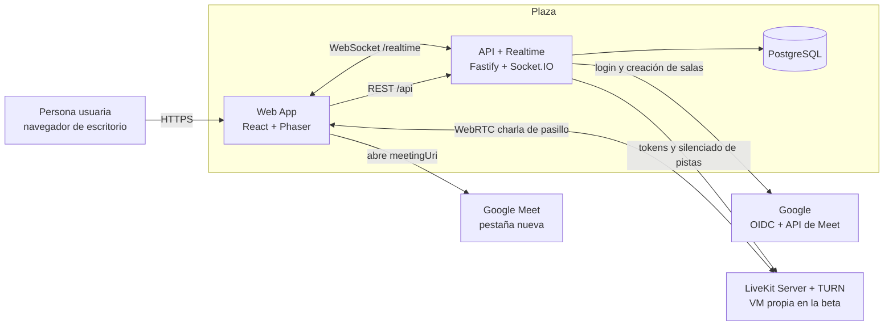
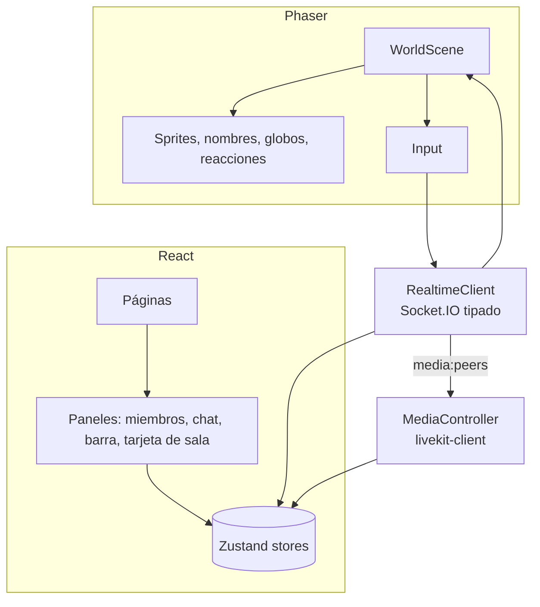
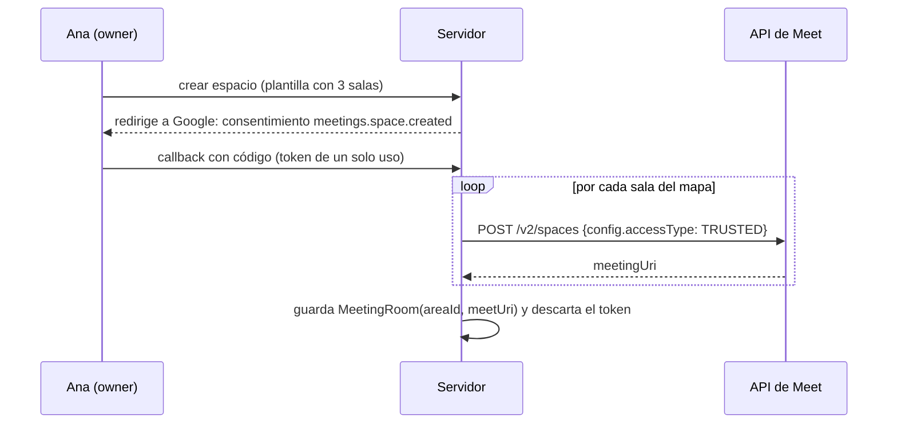
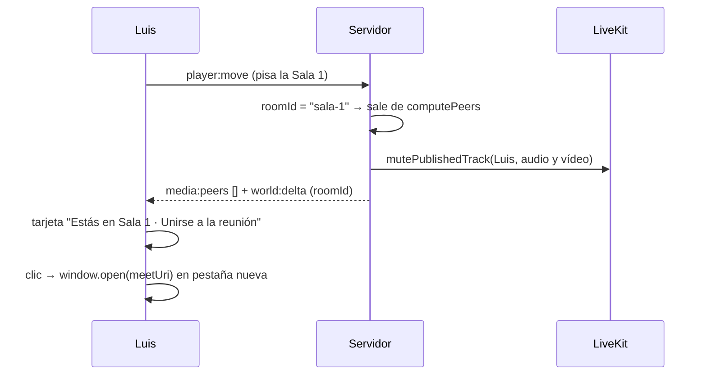

# 02 · Arquitectura — Plaza MVP

Este documento traduce el [brief](./01-brief-requerimiento.md) (v2.1) a una arquitectura concreta.
Cada decisión relevante tiene su ADR (sección 12) con alternativas y motivos.

---

## 1. Principios de arquitectura

1. **Construir lo que nos diferencia, delegar el resto.** Hacemos el mapa, la presencia y la charla de
   pasillo. La identidad (Google) y las reuniones (Google Meet) son servicios externos; el servidor de medios es
   LiveKit de código abierto (gratis), en LiveKit Cloud durante el desarrollo y en una VM propia en la beta.
2. **Un solo lenguaje, tipos compartidos.** TypeScript de punta a punta; los contratos (REST y
   tiempo real) se definen **una vez** con `zod` en un paquete compartido.
3. **El servidor decide.** Posiciones, sala actual y quién debe conectarse con quién se deciden en el servidor.
4. **Lógica de dominio pura.** Colisiones, áreas y proximidad son funciones puras que usan cliente y servidor.
5. **Monolito modular.** Un proceso backend con módulos bien separados y adaptadores para los servicios externos.
6. **Lo simple primero.** Algoritmos directos (O(n²) con n ≤ 50), sin optimizaciones que no hagan falta en el MVP.

## 2. Vista de contexto (C4 nivel 1)



## 3. Vista de contenedores (C4 nivel 2)

| Contenedor | Tecnología | Responsabilidad |
|---|---|---|
| **web** (`apps/web`) | Vite, React 19, Phaser 3, Zustand, TanStack Query, Tailwind CSS, `livekit-client`, `@livekit/components-react` | UI (login, espacios, paneles, barra de medios) y mundo 2D (render, input). |
| **server** (`apps/server`) | Node.js 22 LTS, Fastify 5, Socket.IO 4, Prisma, zod, pino, `@fastify/oauth2`, `google-auth-library`, `livekit-server-sdk` | API REST, login con Google y sesiones, estado vivo de cada espacio, validación de movimiento, motor de proximidad, tokens de LiveKit, creación de salas de Meet, chat. |
| **postgres** | PostgreSQL 16 | Usuarios, sesiones, espacios, membresías, salas y chat. |
| **livekit** | LiveKit Server (código abierto, Apache 2.0) con TURN integrado, en su propia VM | Reenvío de audio/vídeo de la charla de pasillo. En desarrollo se usa el plan gratuito de LiveKit Cloud o un contenedor local. |
| *externo* **Google** | OpenID Connect + API REST de Meet (`spaces.create`) | Identidad y salas de reunión permanentes. |

## 4. Estructura del monorepo

```text
plaza/
├── apps/
│   ├── web/src/
│   │   ├── app/                 # router, providers, layout
│   │   ├── features/
│   │   │   ├── auth/            # botón "Entrar con Google", sesión
│   │   │   ├── spaces/          # lista, crear, invitación, miembros, salas
│   │   │   ├── world/           # integración Phaser (escenas, sprites, input)
│   │   │   ├── media/           # LiveKit, pre-join, tira de vídeos
│   │   │   ├── rooms/           # tarjeta de sala y "Unirse a la reunión"
│   │   │   ├── presence/        # estados, lista de miembros, localizar, ring
│   │   │   └── chat/            # chat del espacio, reacciones
│   │   └── shared/              # ui kit, hooks, api client, i18n
│   └── server/
│       ├── prisma/
│       └── src/
│           ├── modules/         # auth, users, spaces, rooms, world, media, presence, chat
│           ├── adapters/        # google-oidc.ts, google-meet.ts, livekit.ts
│           ├── platform/        # http, socket, db, logger, config, errores
│           └── main.ts
├── packages/
│   ├── shared/src/
│   │   ├── contracts/           # esquemas zod REST + eventos, códigos de error
│   │   ├── world/               # lógica pura: mapa, colisiones, áreas, proximidad
│   │   └── constants.ts
│   └── maps/                    # mapas Tiled (.tmj), tilesets, avatares, manifest
├── e2e/                         # Playwright
├── infra/
│   ├── docker-compose.yml       # local: PostgreSQL (+ LiveKit en modo dev, opcional)
│   ├── app/                     # beta VM 1: Caddy + web + server
│   └── livekit/                 # beta VM 2: livekit.yaml, Caddy, docker-compose (generados con livekit/generate)
├── eslint.config.js · tsconfig.base.json · pnpm-workspace.yaml
└── docs/
```

`packages/shared` **no** depende de React, Phaser, Node ni de librerías de red (regla de ESLint).

## 5. Arquitectura del backend

### 5.1 Capas dentro de cada módulo

```text
modules/<modulo>/
├── <modulo>.routes.ts      # adaptador HTTP: valida con zod y llama al servicio
├── <modulo>.socket.ts      # adaptador Socket.IO (si aplica)
├── <modulo>.service.ts     # casos de uso
├── <modulo>.repository.ts  # acceso a datos (Prisma)
└── __tests__/
```

- Los servicios reciben sus dependencias por constructor (`container.ts`), incluidas las interfaces de
  `adapters/` (`IdentityProvider`, `MeetingProvider`, `MediaProvider`). Así los tests usan dobles y se puede
  cambiar de proveedor sin tocar los servicios.

### 5.2 Módulos

| Módulo | Responsabilidad principal |
|---|---|
| `auth` | Flujo OAuth con Google, sesiones en BD, `requireUser` (HTTP y socket), logout. |
| `users` | Perfil (nombre visible, avatar). |
| `spaces` | Crear espacio, membresías, roles, enlace de invitación, dominio permitido, expulsión. |
| `rooms` | Salas de reunión: crear los Meet de un espacio, sustituir un enlace a mano. |
| `world` | Estado vivo de cada espacio en memoria (`SpaceRuntime`), validación de movimientos, *tick*, motor de proximidad. |
| `media` | Tokens de LiveKit; silenciar pistas al entrar en una sala. |
| `presence` | Estados, actividad, *ring*. |
| `chat` | Chat del espacio (persistido) y reacciones (efímeras). |

### 5.3 Estado vivo de un espacio

```ts
interface PlayerState {
  userId: string;
  displayName: string;
  avatarId: string;
  x: number;                              // casilla
  y: number;
  dir: 'up' | 'down' | 'left' | 'right';
  status: 'available' | 'busy';           // elegido por la persona
  away: boolean;                          // pestaña oculta o inactividad (RN-05)
  roomId: string | null;                  // sala de reunión actual, calculada por el servidor
  inConversation: boolean;                // tiene peers → globo 💬
}

interface SpaceStateStore {               // interfaz sustituible (p. ej. Redis) si hace falta escalar
  getOrLoad(spaceId: string): Promise<SpaceRuntime>;
  unloadIfEmpty(spaceId: string): void;
}
```

El `SpaceRuntime` se crea al entrar la primera persona (carga el mapa) y se descarta 60 s después de que salga la última.

## 6. Arquitectura del frontend



- **React** gestiona el DOM (páginas, paneles, `<video>`); **Phaser** solo el `<canvas>` del mundo.
- React ⇄ Phaser se comunican por *stores* de Zustand y un `EventBus` tipado (órdenes como "localizar a X").
- **`RealtimeClient`**: único punto que habla con Socket.IO; valida los eventos entrantes con zod.
- **`MediaController`**: único punto que habla con LiveKit. Se usan los componentes de
  `@livekit/components-react` (pre-join, pistas de vídeo, indicador de quién habla) para no construir esa UI a mano.

## 7. Modelo de datos

```prisma
model User {
  id          String       @id @default(cuid())
  googleSub   String       @unique            // identificador estable de Google (claim "sub")
  email       String
  displayName String
  avatarId    String       @default("avatar-01")
  createdAt   DateTime     @default(now())
  sessions    Session[]
  memberships Membership[]
}

model Session {
  id        String   @id                      // SHA-256 del token de la cookie
  userId    String
  user      User     @relation(fields: [userId], references: [id], onDelete: Cascade)
  expiresAt DateTime
  @@index([userId])
}

model Space {
  id              String        @id @default(cuid())
  name            String
  slug            String        @unique
  mapTemplateId   String                        // "office-small@1"
  ownerId         String
  inviteTokenHash String        @unique         // regenerar = revocar el anterior
  allowedDomain   String?                       // "empresa.com" → entrada automática
  createdAt       DateTime      @default(now())
  memberships     Membership[]
  rooms           MeetingRoom[]
  messages        ChatMessage[]
}

enum Role { OWNER MEMBER }

model Membership {
  userId   String
  spaceId  String
  role     Role     @default(MEMBER)
  status   String   @default("available")     // available | busy
  joinedAt DateTime @default(now())
  user     User     @relation(fields: [userId], references: [id], onDelete: Cascade)
  space    Space    @relation(fields: [spaceId], references: [id], onDelete: Cascade)
  @@id([userId, spaceId])
}

model MeetingRoom {
  id         String   @id @default(cuid())
  spaceId    String
  areaId     String                             // id del área en el mapa
  meetUri    String                             // https://meet.google.com/abc-defg-hij
  source     String                             // "api" | "manual"
  space      Space    @relation(fields: [spaceId], references: [id], onDelete: Cascade)
  @@unique([spaceId, areaId])
}

model ChatMessage {
  id        String   @id @default(cuid())
  spaceId   String
  authorId  String?                             // null si la cuenta se borró
  body      String   @db.VarChar(1000)
  createdAt DateTime @default(now())
  space     Space    @relation(fields: [spaceId], references: [id], onDelete: Cascade)
  @@index([spaceId, createdAt])
}
```

Las posiciones no se guardan en BD (son efímeras). **No se guarda ningún *token* de Google.**

## 8. Mapas

- Se diseñan en **Tiled** y se exportan como JSON (`.tmj`) en `packages/maps/templates/<id>/`.
- Capas obligatorias (validadas en CI):

| Capa | Tipo | Uso |
|---|---|---|
| `floor` | tiles | Suelo |
| `decor-below` / `decor-above` | tiles | Decoración por debajo / encima de los avatares |
| `collision` | tiles | Cualquier tile ≠ 0 bloquea el paso |
| `rooms` | objetos (**solo rectángulos**) | Salas de reunión. Propiedades: `areaId`, `name` |
| `spawns` | objetos (puntos) | Puntos de aparición |

- `shared/world` expone `parseMap(tmj) → WorldMap { width, height, collisionGrid, rooms, spawns }` y
  `roomAt(map, x, y)`, usados igual en cliente y servidor.

## 9. Protocolo de tiempo real

### 9.1 Conexión

- Socket.IO en `/realtime`, transporte WebSocket, autenticado con la cookie de sesión.
- El cliente emite `space:join { spaceId }`; el servidor verifica la membresía y responde con el estado completo.
- Cada evento lleva `v` (versión del protocolo); si no coincide → `error { code: "PROTOCOL_MISMATCH" }`.

### 9.2 Catálogo de eventos (`packages/shared/src/contracts/realtime/`)

| Dirección | Evento | Payload (resumen) | Notas |
|---|---|---|---|
| C→S | `space:join` | `{ spaceId }` | *ack* con `space:snapshot` |
| S→C | `space:snapshot` | `{ self, players[], rooms[], mapTemplateId }` | Estado inicial (incluye los `meetUri`) |
| C→S | `player:move` | `{ x, y, dir }` | Una casilla por evento; máx. 10/s |
| S→C | `player:correct` | `{ x, y }` | Paso rechazado: el cliente recoloca el avatar |
| S→C | `world:delta` | `{ moved[], joined[], left[], changed[] }` | Cada *tick* (15 Hz) solo si hay cambios |
| C→S | `player:status` | `{ status }` | `available` / `busy` |
| C→S | `player:away` | `{ away }` | Pestaña oculta o inactividad |
| S→C | `media:peers` | `{ peers: userId[] }` | Con quién debe estar conectado en el pasillo |
| C→S / S→C | `chat:send` / `chat:message` | `{ body }` / `{ id, authorId, body, createdAt }` | |
| C→S / S→C | `reaction` | `{ emoji }` / `{ userId, emoji }` | Efímero |
| C→S / S→C | `ring:send` / `ring:received` | `{ toUserId }` / `{ fromUserId }` | RN-11 |
| S→C | `space:kicked` | `{ reason }` | Expulsión o sesión reemplazada |
| S→C | `error` | `{ code, message }` | Códigos en `shared` |

### 9.3 Movimiento

El cliente mueve el avatar al instante y envía `player:move`. El servidor comprueba que la casilla sea
adyacente y transitable y respete el *rate limit*; si no, responde `player:correct` y el cliente simplemente
recoloca el avatar (sin reconciliación por secuencia: en una oficina casi nunca ocurre).
Los demás reciben el cambio en el siguiente `world:delta` y lo animan durante un *tick*.

## 10. Charla de pasillo y salas de reunión

### 10.1 Motor de proximidad (función pura en `shared/world`)

```ts
export function computePeers(
  players: ReadonlyArray<PlayerState>,
  prev: ReadonlyMap<string, ReadonlySet<string>>,
  cfg: { radius: number; hysteresis: number; maxPeers: number },
): Map<string, Set<string>>;
```

1. Descartar a quien está en una sala (`roomId !== null`, RN-03) o *Ocupado* (RN-04).
2. Para cada par (A, B) del resto (**todos contra todos**, con n ≤ 50 son ≤ 1 225 pares):
   conectados si `dist ≤ radius`, o si ya lo estaban y `dist ≤ radius + hysteresis` (RN-01, RN-02).
3. Recortar a `maxPeers` (8) por distancia (RN-07).
4. El servidor compara con el resultado anterior y solo emite `media:peers` a quien cambie.

### 10.2 Medios del pasillo con LiveKit

- **Una sala de LiveKit por espacio** (`space_<spaceId>`); identidad = `userId`. El servidor emite el token.
- El cliente publica micro y cámara (simulcast) y **se suscribe solo a las pistas de sus `peers`**
  (`autoSubscribe: false`). El vídeo se desvanece según la distancia.
- **Riesgo aceptado (RN-12):** un cliente modificado de un miembro del espacio podría suscribirse a pistas
  de pasillo que no le tocan. Es coherente con "el pasillo no es privado" y se comunica en la interfaz.
  Post-MVP: `setTrackSubscriptionPermissions` por publicador.

### 10.3 Salas de reunión con Google Meet





- **Creación:** al crear el espacio se pide al *owner* el *scope* `meetings.space.created` (autorización incremental,
  solo esa vez). Se crea un *space* de Meet por sala con `accessType: TRUSTED` (miembros de la organización e
  invitados). El *token* se usa y se descarta: **Plaza no guarda credenciales de Google**.
- **Alternativa manual:** si el *owner* no concede el permiso o la app no está verificada, puede pegar un
  enlace de Meet por sala (`source: "manual"`).
- **Entrar en una sala:** el servidor calcula `roomId`, saca a la persona de la proximidad y **silencia sus pistas
  en LiveKit** con la API de servidor (defensa aunque el cliente falle). El cliente muestra la tarjeta de la sala.
- **Salir de la sala:** el cliente reactiva sus medios (si estaban activos antes) y vuelve a la proximidad.
- **Presencia en salas:** se basa en la posición del avatar en el mapa (quién está dentro de la sala), no en
  quién está conectado al Meet. Mostrar los participantes reales de Meet queda para post-MVP.

## 11. Transversales

### 11.1 Seguridad

| Tema | Decisión |
|---|---|
| Login | OAuth 2.0 *authorization code* + PKCE + `state` con `@fastify/oauth2`; `id_token` verificado con `google-auth-library` (audiencia, emisor, caducidad). *Scopes*: `openid email profile`. |
| Sesión | Cookie `plaza_sid` con token aleatorio de 32 bytes; en BD se guarda su hash. `HttpOnly`, `Secure`, `SameSite=Lax`, 30 días deslizantes. |
| Dominio | Si el espacio tiene `allowedDomain`, se comprueba el claim `hd`/`email_verified` del `id_token`. |
| CSRF | `SameSite=Lax` + cabecera `X-Plaza-Client` obligatoria en peticiones que modifican. |
| Validación | zod en **todas** las entradas REST y de socket. |
| Rate limit | *Token bucket* por socket para `player:move`, `chat:send`, `reaction`, `ring:send`. |
| Autorización | Guardas `assertOwner`, `assertMember` en los servicios. |
| Cabeceras | `@fastify/helmet` con CSP (orígenes propios + dominio de LiveKit). |
| Secretos | Variables de entorno validadas con zod al arrancar. |
| Tests | Ruta de login de prueba **solo** si `AUTH_TEST_LOGIN=true` (nunca en producción; el arranque falla si está activa con `NODE_ENV=production`). |

### 11.2 Errores

`AppError { code, httpStatus }` con un *handler* central → `{ error: { code, message } }`. Los códigos viven
en `shared` para que el cliente los traduzca.

### 11.3 Observabilidad

Logs JSON con `pino` (`requestId`, `userId`, `spaceId`), errores de cliente y servidor en **Sentry**, y
`GET /api/health` con conectados por espacio y duración media del *tick*. Métricas más ricas, post-MVP.

### 11.4 Entornos

| Entorno | Descripción |
|---|---|
| `local` | `pnpm dev` + `docker compose up` (Postgres); LiveKit Cloud plan gratuito (máx. 5 conexiones) o `livekit-server --dev` en contenedor; cliente OAuth de desarrollo. |
| `ci` | Postgres y `livekit-server --dev` en contenedores; Playwright con medios falsos y login de prueba. |
| `staging` / `beta` | **VM 1** (app): Caddy + web + server, Postgres gestionado o con copia diaria. **VM 2** (medios): LiveKit + TURN propios (ver §11.5). |

El código es idéntico en todos los entornos: solo cambian `LIVEKIT_URL`, `LIVEKIT_API_KEY` y `LIVEKIT_API_SECRET`.

### 11.5 Servidor de medios propio (beta)

Dimensionado para la beta: unas 50 personas por espacio y hasta ~150 conectadas en total, en conversaciones
de 2 a 8. Como referencia, el *benchmark* oficial de LiveKit sostiene una reunión de 150 publicadores y 150
suscriptores de vídeo en 16 núcleos; la carga de Plaza es una fracción de eso.

| Recurso | Especificación | Motivo |
|---|---|---|
| Máquina | VM **optimizada para cómputo, 4 vCPU, 8 GB RAM**, dedicada a LiveKit | LiveKit consume sobre todo CPU y red |
| Red | **IP pública**, puerto ≥ 1 Gbps, proveedor con **tráfico incluido** (≥ 2 TB/mes) | Los medios salen directamente de la VM; en nubes que cobran la salida, el tráfico puede costar más que la máquina |
| Puertos | TCP 443 y 7881 · UDP 443 · UDP 50000–60000 | Medios por UDP; TURN/TLS en 443 para redes corporativas |
| Dominios | `livekit.<dominio>` y `turn.<dominio>` con certificados válidos (Let's Encrypt vía Caddy) | LiveKit no acepta certificados autofirmados |
| Docker | `network_mode: host` | Evita latencia añadida en los medios |
| Redis | No en la beta (una sola VM) | Solo hace falta con varias VMs de LiveKit |
| Coste estimado | ~20–40 US$/mes (según proveedor) | Frente a ~240 US$/mes estimados en LiveKit Cloud |

- **Por qué una VM separada:** LiveKit usa la red del *host* y el puerto 443 para TURN, que chocaría con Caddy de la app.
- **Monitorización:** LiveKit expone métricas Prometheus; en la beta basta con un monitor externo de disponibilidad
  y alertas de CPU > 70 % y tráfico mensual > 80 % de lo incluido.
- **Si la VM de medios cae:** se pierde el audio/vídeo del pasillo (el mapa, el chat y las salas de Meet siguen
  funcionando). Plan de contingencia en el *runbook*: cambiar las variables a LiveKit Cloud (plan de pago) y reiniciar el servidor.
- **Conexión permanente:** con servidor propio el coste no depende de los minutos, así que cada persona se conecta a
  LiveKit al entrar al espacio y se mantiene conectada (las conversaciones empiezan más rápido).

## 12. Registro de decisiones (ADR)

### ADR-001 · Monorepo con pnpm workspaces
- **Decisión:** `apps/web`, `apps/server`, `packages/shared`, `packages/maps`; scripts con `pnpm -r`.
- **Motivo:** compartir contratos y lógica sin publicar paquetes, con el mínimo de herramientas.
- **Alternativas:** Turborepo o Nx (caché de tareas; se añade si el CI se vuelve lento).

### ADR-002 · Tiempo real con Socket.IO
- **Decisión:** Socket.IO 4 sobre Fastify.
- **Motivo:** salas, *acks* y reconexión listos. **Alternativas:** `ws` puro, Colyseus.

### ADR-003 · Charla de pasillo con LiveKit
- **Decisión:** LiveKit (SFU de código abierto), una sala por espacio, suscripción selectiva desde el cliente según `media:peers`.
  **Desarrollo:** plan gratuito de LiveKit Cloud o contenedor local. **Staging y beta:** LiveKit + TURN en una VM propia (§11.5).
- **Motivo:** el software es gratuito; alojarlo nosotros cuesta ~20–40 US$/mes frente a ~240 US$/mes estimados en
  LiveKit Cloud para la beta. Usar Cloud en desarrollo evita montar infraestructura antes de tiempo, y el código es el mismo.
- **Coste asumido:** ~8 puntos de trabajo (desplegar la VM de medios y validar TURN en redes corporativas) y su mantenimiento.
- **Alternativas:** LiveKit Cloud también en la beta (sin operación, más caro), malla P2P (no escala a grupos),
  Google Meet (no se puede incrustar, ver ADR-010).
- **Riesgo aceptado:** privacidad del pasillo basada en el cliente (RN-12).

### ADR-004 · Phaser 3 para el mundo + React para la UI
- **Decisión:** Phaser solo para el canvas; React y `@livekit/components-react` para lo demás.
- **Motivo:** Phaser trae mapas de Tiled, cámara y animaciones; los componentes de LiveKit ahorran la UI de medios.

### ADR-005 · Movimiento por casillas validado en el servidor
- **Decisión:** el cliente mueve y avisa; el servidor valida adyacencia y colisión y, si rechaza, el cliente recoloca.
- **Motivo:** validación trivial y proximidad determinista, sin la complejidad de la reconciliación de videojuegos.

### ADR-006 · Mapas de Tiled con salas rectangulares
- **Decisión:** plantillas versionadas (`id@version`) en `packages/maps`; salas solo rectangulares.
- **Motivo:** sin editor propio en el MVP; los rectángulos simplifican la geometría y la validación.

### ADR-007 · Login solo con Google
- **Decisión:** OpenID Connect con Google; el usuario se identifica por `sub`; sesiones propias en Postgres.
- **Motivo:** sin contraseñas ni recuperación de cuentas; los pilotos ya usan Google Workspace; permite restringir por dominio.
- **Alternativas:** email y contraseña (más código y más riesgo), proveedores múltiples (post-MVP, el modelo por `sub` lo permite).

### ADR-008 · Prisma como ORM
- **Decisión:** Prisma + migraciones versionadas. **Alternativa:** Drizzle.

### ADR-009 · Monolito modular con adaptadores
- **Decisión:** un proceso `server`; los servicios externos detrás de interfaces en `adapters/`.
- **Motivo:** menor coste operativo y proveedores intercambiables.

### ADR-010 · Salas de reunión con Google Meet
- **Decisión:** cada sala del mapa se enlaza a un *space* permanente de Google Meet creado con la API REST de Meet;
  al entrar en la sala se ofrece "Unirse a la reunión", que abre Meet en una pestaña nueva.
- **Motivo:** Meet ya resuelve reuniones grandes, pantalla compartida, grabación, transcripción y la privacidad de
  la sala; nos ahorra las salas de medios, la vigilancia de suscripciones y la pantalla compartida propias.
- **Restricciones conocidas:** Meet **no se puede incrustar** en otra web (bloqueo de iframes); la API de medios
  en tiempo real de Meet sigue en vista previa para desarrolladores y solo permite recibir medios.
- **Alternativas descartadas:**
  - *Todo con Meet* (cada persona siempre en su propio Meet): se pierde la conexión automática sobre el mapa,
    obliga a estar todo el día en una llamada y cambiar de pestaña para cada charla.
  - *Salas con LiveKit dentro del mapa*: mejor experiencia pero más desarrollo; es el plan B si O6 sale bajo.

## 13. Evolución post-MVP

1. Si la métrica O6 es baja → salas dentro del mapa con LiveKit (una sala de LiveKit por área).
2. Privacidad del pasillo con permisos de suscripción por publicador.
3. Varias instancias de `server` con adaptador Redis de Socket.IO y afinidad por espacio.
4. Varias VMs de LiveKit con Redis, o LiveKit Cloud, si la carga supera una sola VM.
