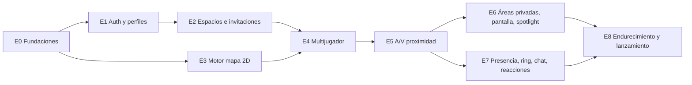

# 04 · Plan de desarrollo — Plaza MVP

Plan sistemático por **etapas (épicas)** derivado del [brief](./01-brief-requerimiento.md) y de la
[arquitectura](./02-arquitectura.md). Cada etapa termina en algo **demostrable** y deja el sistema desplegable.

---

## 1. Supuestos de planificación

| Supuesto | Valor |
|---|---|
| Equipo | 2 desarrolladores full-stack TS + 1 perfil de producto/diseño/QA a media jornada |
| Sprint | 2 semanas |
| Velocidad estimada | ~35 puntos netos por sprint, ya descontado un 15 % de reserva para errores y revisión (se recalibra tras el sprint 2) |
| Estimación | Puntos de historia en Fibonacci (ver [DoR](./03-estandares-codigo.md#10-definition-of-ready-dor-de-una-historia)) |
| Duración total | 7 sprints ≈ **14 semanas** hasta la beta privada |

## 2. Etapas y dependencias

| Etapa | Objetivo | Requisitos que cubre | Puntos | Resultado demostrable |
|---|---|---|---|---|
| [E0](./historias/E0-fundaciones.md) | Base técnica y reducción de riesgo | RNF-08, RNF-09 (base) | 22 | `pnpm dev` levanta todo; CI verde; *spike* de A/V por proximidad |
| [E1](./historias/E1-autenticacion-perfiles.md) | Identidad | RF-01, RF-02, RNF-05 | 18 | Registro, login y elección de avatar |
| [E2](./historias/E2-espacios-invitaciones.md) | Espacios y acceso | RF-03, RF-04, RN-08 | 22 | Crear espacio desde plantilla e invitar |
| [E3](./historias/E3-motor-mapa-2d.md) | Mundo 2D local | RF-05, RF-06 (+ RF-21 Should) | 26 | Caminar por el mapa con colisiones y cámara; abrir objetos interactivos |
| [E4](./historias/E4-multijugador-tiempo-real.md) | Mundo compartido | RF-07, RN-06, RN-10, RNF-01, RNF-04 | 29 | Varias personas se ven moverse en tiempo real |
| [E5](./historias/E5-audio-video-proximidad.md) | Conversación por proximidad | RF-08, RF-09, RN-01, RN-02, RNF-02 | 31 | Acercarse y hablar por vídeo automáticamente |
| [E6](./historias/E6-areas-privadas-pantalla.md) | Reuniones y eventos | RF-10, RF-11 (+ RF-20 Should), RN-03, RN-07, RN-11, RNF-06 | 29 | Sala privada aislada, pantalla compartida y *spotlight* |
| [E7](./historias/E7-presencia-chat-reacciones.md) | Etiqueta social | RF-12..RF-15, RF-18 (+ RF-16, RF-17 Should), RN-04, RN-05, RN-12 | 34 | Estados con auto-silencio, *ring*, lista de miembros, chat, emojis y seguir |
| [E8](./historias/E8-endurecimiento-lanzamiento.md) | Calidad y lanzamiento | RNF-01..RNF-10, criterios §11 del brief | 31 | Beta privada desplegada con pilotos |
| | | **Total** (224 Must + 18 Should) | **242** | |

## 3. Plan por sprints

Se trabaja en **dos carriles** en paralelo cuando las dependencias lo permiten
(carril A: backend/tiempo real · carril B: frontend/mundo).

| Sprint | Semanas | Carril A | Carril B | Pts | Hito al cierre |
|---|---|---|---|---|---|
| 1 | 1–2 | E0 (S1–S3, S5–S8) · E1-S1..S3, S6 | E0-S4 · E1-S4 | 37 | **M1 · "Hola, mundo autenticado"**: login en *staging*; *spike* de A/V validado |
| 2 | 3–4 | E2 completo | E1-S5 · E3-S1, S2, S6 | 38 | Crear espacio + invitar; mapa visible |
| 3 | 5–6 | E4-S1..S4, S6, S7 | E3-S3..S5 · E4-S5 | 39 | **M2 · "Caminamos juntos"**: 2+ personas se mueven en el mismo mapa |
| 4 | 7–8 | E5-S1..S3, S7 · E6-S1 | E5-S4..S6 | 34 | **M3 · "Hablamos por proximidad"**: el equipo empieza a usarlo a diario (*dogfooding*) |
| 5 | 9–10 | E6-S2, S4, S7 · E7-S1, S3, S7 | E6-S3, S5, S6 | 34 | Reuniones privadas con pantalla; auto-silencio y *ring* |
| 6 | 11–12 | E7-S4 · E8-S1 · *Should*: E6-S8 | E7-S2, S5 · *Should*: E3-S7, E7-S6, E7-S8 | 34 | **M4 · Funcionalidad congelada** (*feature freeze*) |
| 7 | 13–14 | E8-S2, S3, S5 | E8-S4, S6, S7 · corrección de errores | 26 | **M5 · Beta privada** con 5 equipos piloto |

> Los sprints 1–3 van algo cargados a propósito (la base es más predecible); el sprint 7 deja margen
> para los errores de los pilotos. Las historias **Should** (E3-S7, E6-S8, E7-S6, E7-S8) son las
> primeras en salir del alcance si el sprint 6 va con retraso, en este orden: escritorios →
> objetos interactivos → *spotlight* → seguir.

## 4. Estrategia de ejecución

1. **Reducir riesgo pronto:** el mayor riesgo técnico (A/V por proximidad con SFU) se valida con un
   *spike* limitado en el tiempo en el sprint 1 (E0-S8), antes de construir encima.
2. **Lógica pura primero:** en E3–E6 se implementa y prueba primero la función de `world-core`
   (colisiones, proximidad, áreas) y después la integración en red y UI.
3. **Contrato primero:** cada historia que toca red empieza añadiendo el esquema zod en `@plaza/shared`;
   así los dos carriles trabajan en paralelo contra el mismo contrato.
4. **Rebanadas verticales:** cada historia deja algo usable de punta a punta, aunque sea mínimo.
5. **Dogfooding desde M3:** el propio equipo trabaja dentro de Plaza a partir del sprint 5; los fallos
   encontrados se priorizan en la planificación siguiente.

## 5. Matriz de trazabilidad (requisito → historias)

| Requisito | Historias |
|---|---|
| RF-01 Registro/login | E1-S1, E1-S2, E1-S3, E1-S4, E1-S6 |
| RF-02 Perfil y avatar | E1-S5 |
| RF-03 Crear espacio | E2-S1, E2-S2, E2-S3 |
| RF-04 Invitar | E2-S4, E2-S5, E2-S6 |
| RF-05 Mapa 2D | E3-S1, E3-S2, E3-S5, E3-S6 |
| RF-06 Movimiento | E3-S3, E3-S4, E4-S3 |
| RF-07 Multijugador | E4-S1, E4-S2, E4-S4, E4-S5, E4-S6 |
| RF-08 A/V por proximidad | E0-S8, E5-S1, E5-S2, E5-S3, E5-S5, E5-S6 |
| RF-09 Controles de medios | E5-S4, E5-S6 |
| RF-10 Áreas privadas | E6-S1, E6-S2, E6-S3, E6-S4 |
| RF-11 Compartir pantalla | E6-S5, E6-S6 |
| RF-12 Estados y auto-silencio | E7-S1 |
| RF-13 Lista de miembros | E7-S2 |
| RF-14 Chat | E7-S3, E7-S4 |
| RF-15 Reacciones | E7-S5 |
| RF-16 Escritorios (Should) | E7-S6 |
| RF-17 Seguir (Should) | E7-S8 |
| RF-18 Llamar (*ring*) | E7-S7 |
| RF-20 *Spotlight* (Should) | E6-S8 |
| RF-21 Objetos interactivos (Should) | E3-S7 |
| RN-07 Máx. peers | E6-S7 |
| RN-11 *Spotlight* dirigido | E6-S8 |
| RN-12 Límite de *ring* | E7-S7 |
| RNF-01 / RN-06 Rendimiento y 50 usuarios | E4-S7, E8-S3 |
| RNF-02 Latencia A/V | E5-S5, E8-S1 |
| RNF-04 Reconexión | E4-S6, E5-S5 |
| RNF-05 Seguridad | E1-S3, E1-S6, E8-S2 |
| RNF-06 Privacidad | E6-S4, E8-S2, E8-S6 |
| RNF-07 Accesibilidad / RNF-10 i18n | E0-S4, E8-S6 |
| RNF-08 Observabilidad | E0-S3, E8-S1 |

## 6. Riesgos por etapa

| Etapa | Riesgo | Señal de alerta | Plan de contingencia |
|---|---|---|---|
| E0 | El *spike* de LiveKit muestra latencias altas | Conexión > 3 s en el *spike* | Revisar configuración de TURN/UDP; alternativa: sala LiveKit por grupo de conversación |
| E3 | Rendimiento de Phaser con mapas grandes | < 50 fps con el mapa de plantilla | Limitar tamaño de plantilla (≤ 100×100), capas estáticas en *render texture* |
| E4 | Desincronización de posiciones | Correcciones frecuentes en uso normal | Aumentar tolerancia de *rate*, revisar reconciliación por `seq` |
| E5 | Permisos de cámara/micrófono y Safari | Fallos en pre-join en Safari | Matriz de pruebas por navegador desde E5; mensajes de ayuda |
| E6 | Privacidad de áreas | Test de privacidad falla | Bloquear el lanzamiento (criterio del brief §11) |
| E8 | Redes corporativas bloquean UDP | Pilotos sin A/V | TURN/TLS en 443 verificado antes de invitar |

## 7. Ceremonias y seguimiento

- *Planning* al inicio de cada sprint, usando las historias de `historias/` como backlog.
- *Demo* al cierre contra el hito de la tabla §3 (se graba en vídeo para el equipo).
- *Retro* quincenal; recalibrar velocidad tras el sprint 2 y reajustar §3.
- Tablero: columnas *Backlog → Ready (cumple DoR) → In progress → Review → Staging → Done (cumple DoD)*.
