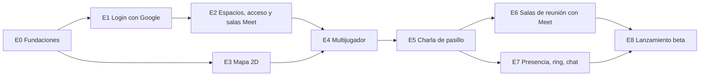

# 04 · Plan de desarrollo — Plaza MVP

Plan sistemático por **etapas (épicas)** derivado del [brief](./01-brief-requerimiento.md) (v2.1) y de la
[arquitectura](./02-arquitectura.md). Cada etapa termina en algo **demostrable** y deja el sistema desplegable.

---

## 1. Supuestos de planificación

| Supuesto | Valor |
|---|---|
| Equipo | 2 desarrolladores full-stack TS + 1 perfil de producto/diseño/QA a media jornada |
| Sprint | 2 semanas |
| Velocidad estimada | ~35 puntos netos por sprint, ya descontado un 15 % para errores y revisión (se recalibra tras el sprint 2) |
| Estimación | Puntos de historia en Fibonacci (ver [DoR](./03-estandares-codigo.md#10-definition-of-ready-dor-de-una-historia)) |
| Duración total | 5 sprints ≈ **10 semanas** hasta la beta privada (antes: 7 sprints) |

## 2. Etapas y dependencias

| Etapa | Objetivo | Requisitos que cubre | Puntos | Resultado demostrable |
|---|---|---|---|---|
| [E0](./historias/E0-fundaciones.md) | Base técnica y reducción de riesgo | RNF-08, RNF-09 (base) | 18 | `pnpm dev` levanta todo; CI verde; *spike* con LiveKit Cloud (plan gratuito) |
| [E1](./historias/E1-login-google-perfil.md) | Identidad con Google | RF-01, RF-02, RNF-05 | 12 | "Entrar con Google" y elegir avatar |
| [E2](./historias/E2-espacios-acceso-salas.md) | Espacios, acceso y salas de Meet | RF-03, RF-04, RF-10 (creación), RN-08 | 24 | Crear espacio con sus salas de Meet e invitar al equipo |
| [E3](./historias/E3-motor-mapa-2d.md) | Mundo 2D local | RF-05, RF-06 | 21 | Caminar por el mapa con colisiones y cámara |
| [E4](./historias/E4-multijugador-tiempo-real.md) | Mundo compartido | RF-07, RN-06, RN-10, RNF-01, RNF-04 | 20 | Varias personas se ven moverse en tiempo real |
| [E5](./historias/E5-charla-pasillo.md) | Charla de pasillo y servidor de medios propio | RF-08, RF-09, RN-01, RN-02, RN-04, RN-07, RN-12, RNF-02, RNF-04 | 29 | Acercarse y hablar por vídeo automáticamente, sobre nuestro propio LiveKit |
| [E6](./historias/E6-salas-reunion-meet.md) | Reuniones | RF-10, RN-03, RNF-06, O6 | 12 | Entrar en una sala → aislado del pasillo → Google Meet |
| [E7](./historias/E7-presencia-chat-reacciones.md) | Etiqueta social | RF-11..RF-15, RN-05, RN-11 | 16 | Estados con auto-silencio, *ring*, miembros, chat y emojis |
| [E8](./historias/E8-lanzamiento-beta.md) | Calidad y lanzamiento | RNF-01..RNF-10, brief §11 | 22 | Beta privada con pilotos y métricas |
| | | **Total** | **174** | |

## 3. Plan por sprints

Dos carriles en paralelo cuando las dependencias lo permiten
(carril A: backend/tiempo real · carril B: frontend/mundo).

| Sprint | Semanas | Carril A | Carril B | Pts | Hito al cierre |
|---|---|---|---|---|---|
| 1 | 1–2 | E0 (S1–S3, S5–S7) · E1-S1, S2 · E2-S2 | E0-S4 · E1-S3, S4 · E3-S1 | 36 | **M1 · "Hola, mundo autenticado"**: login con Google en *staging*; *spike* validado |
| 2 | 3–4 | E2-S4..S7 | E2-S1, S3 · E3-S2, S3, S6 | 34 | Crear espacio con salas de Meet + invitar; caminar por el mapa |
| 3 | 5–6 | E4 completo · E5-S1, S3 | E3-S4, S5 · E5-S4 | 33 | **M2 · "Caminamos juntos"**: varias personas en el mismo mapa; pre-join listo |
| 4 | 7–8 | E5-S2, S5, S7 · E6-S1, S3 | E5-S6 · E6-S2, S4 · E7-S1 | 35 | **M3 · "Hablamos y nos reunimos"**: el equipo trabaja a diario en Plaza (*dogfooding*) sobre el LiveKit propio |
| 5 | 9–10 | E5-S8 · E7-S3, S5 · E8-S1..S3, S5 | E7-S2, S4 · E8-S4, S6, S7 | 36 | **M4 · Beta privada** con 5 equipos piloto |

> Alojar LiveKit en la beta añade 8 puntos (E5-S7 y E5-S8) y deja el sprint 5 sin margen. Si hay retraso,
> lo primero que se recorta es E7-S4 (reacciones) y la personalización de E5-S4; si no basta, la beta se
> retrasa una semana o se lanza con LiveKit Cloud (plan de pago) y se migra a la VM propia justo después.

## 4. Estrategia de ejecución

1. **Reducir riesgo pronto:** la charla de pasillo y el silenciado desde el servidor se validan con un *spike*
   sobre el plan gratuito de LiveKit Cloud en el sprint 1 (E0-S7); el servidor de medios propio se monta en el
   sprint 4 (E5-S7) para que el equipo lo use a diario antes de la beta, y TURN se valida en redes reales en el sprint 5 (E5-S8). El trámite de Google (proyecto, consentimiento, API de Meet)
   también arranca en el sprint 1 (E0-S5), porque depende de terceros.
2. **Lógica pura primero:** en E3–E6 se implementa y prueba primero la función de `shared/world`
   (colisiones, salas, proximidad) y después la integración en red y UI.
3. **Contrato primero:** cada historia que toca red empieza añadiendo el esquema zod en `@plaza/shared`.
4. **Delegar antes que construir:** antes de construir UI de medios, comprobar si `@livekit/components-react`
   ya la resuelve; antes de construir algo de reuniones, comprobar si Google Meet ya lo hace.
5. **Dogfooding desde M3:** el equipo trabaja dentro de Plaza desde la semana 9.

## 5. Matriz de trazabilidad (requisito → historias)

| Requisito | Historias |
|---|---|
| RF-01 Login con Google | E1-S1, E1-S2, E1-S3 |
| RF-02 Perfil y avatar | E1-S4 |
| RF-03 Crear espacio | E2-S1, E2-S2, E2-S3 |
| RF-04 Acceso al espacio | E2-S4, E2-S5, E2-S6 |
| RF-05 Mapa 2D | E3-S1, E3-S2, E3-S5, E3-S6 |
| RF-06 Movimiento | E3-S3, E3-S4, E4-S3 |
| RF-07 Multijugador | E4-S1, E4-S2, E4-S4, E4-S5, E4-S6 |
| RF-08 A/V por proximidad | E0-S7, E5-S1, E5-S2, E5-S3, E5-S5, E5-S6, E5-S7, E5-S8 |
| RF-09 Controles de medios | E5-S4, E5-S6 |
| RF-10 Salas con Google Meet | E2-S7, E6-S1, E6-S2, E6-S3, E6-S4 |
| RF-11 Estados | E7-S1 |
| RF-12 Lista de miembros | E7-S2 |
| RF-13 Chat del espacio | E7-S3 |
| RF-14 Reacciones | E7-S4 |
| RF-15 Llamar (*ring*) | E7-S5 |
| RN-03 Sala aísla del pasillo | E5-S1, E6-S2, E6-S3 |
| RN-07 Máx. 8 en el pasillo | E5-S1 |
| RN-12 Pasillo no privado (aviso) | E5-S6 |
| RNF-01 / RN-06 Rendimiento y 50 usuarios | E4-S5, E8-S3 |
| RNF-02 Latencia A/V | E5-S5 |
| RNF-04 Disponibilidad y reconexión | E4-S6, E5-S5, E5-S7, E8-S5 |
| RNF-05 Seguridad | E1-S2, E8-S2 |
| RNF-06 Privacidad | E2-S7, E6-S3, E8-S2, E8-S6 |
| RNF-07 Accesibilidad / RNF-10 i18n | E0-S4, E8-S6 |
| RNF-08 Observabilidad | E0-S3, E8-S1 |

## 6. Riesgos por etapa

| Etapa | Riesgo | Señal de alerta | Plan de contingencia |
|---|---|---|---|
| E0 | El *spike* muestra latencias altas | Conexión > 3 s | Revisar región del servidor; medir también con LiveKit local |
| E5 | El servidor de medios propio da problemas (red, certificados, CPU) | Fallos del E2E contra *staging*; alertas de CPU | Contingencia: LiveKit Cloud de pago cambiando variables; revisar dimensionado (§11.5 de la arquitectura) |
| E5 | TURN no atraviesa la red de un piloto | La prueba de E5-S8 falla | Pedir a TI que permita `turn.<dominio>:443`; posponer ese piloto |
| E1–E2 | Google exige verificación para el *scope* de Meet | La pantalla de consentimiento bloquea a usuarios fuera de la lista de prueba | Modo de pruebas con los pilotos; enlaces de Meet pegados a mano (E2-S7) |
| E3 | Rendimiento de Phaser con mapas grandes | < 50 fps con la plantilla "Campus" | Reducir la plantilla o dibujar capas estáticas en una textura |
| E5 | Permisos de cámara/micrófono en Safari | Fallos en pre-join | Probar en todos los navegadores desde E5-S4 |
| E6 | La gente no pulsa "Unirse a la reunión" (cambio de pestaña) | O6 < 70 % en el *dogfooding* | Mejorar la tarjeta; plan B post-MVP: salas con LiveKit dentro del mapa |
| E8 | Límite de 60 min de Meet en cuentas gratuitas | Pilotos sin Workspace de pago | Elegir pilotos con Workspace de pago |

## 7. Ceremonias y seguimiento

- *Planning* al inicio de cada sprint, usando las historias de `historias/` como backlog.
- *Demo* al cierre contra el hito de la tabla §3 (se graba en vídeo para el equipo).
- *Retro* quincenal; recalibrar velocidad tras el sprint 2 y reajustar §3.
- Tablero: columnas *Backlog → Ready (cumple DoR) → In progress → Review → Staging → Done (cumple DoD)*.
