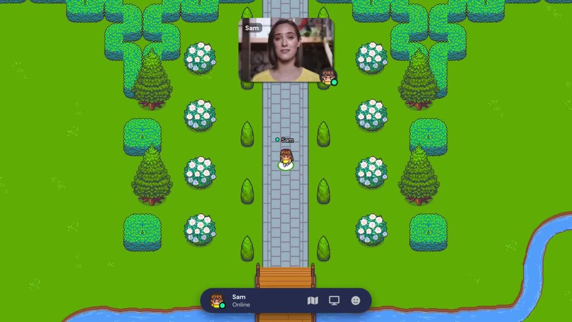
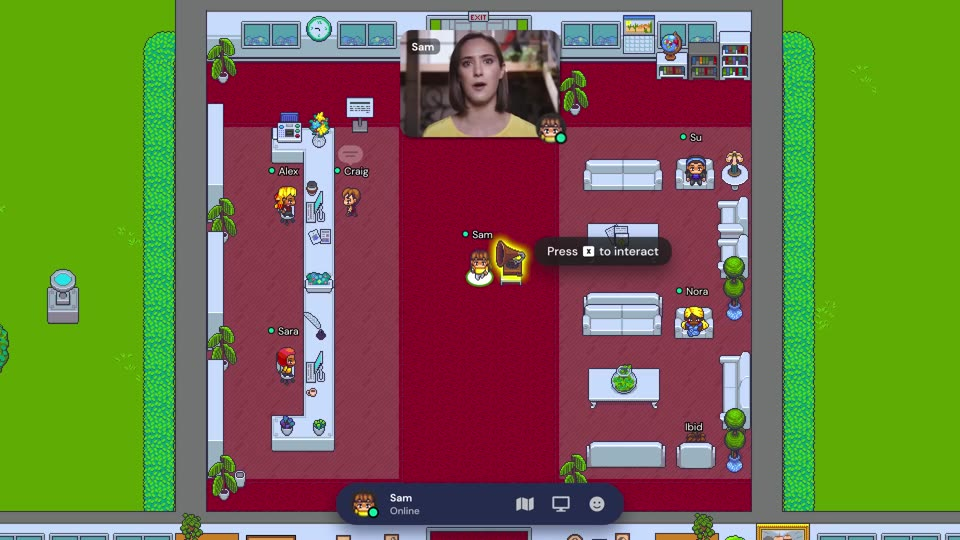
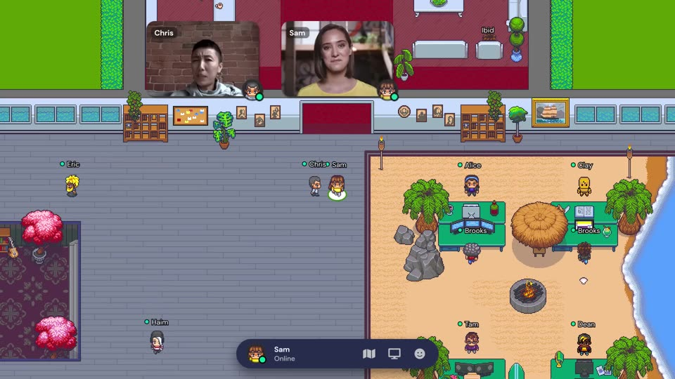
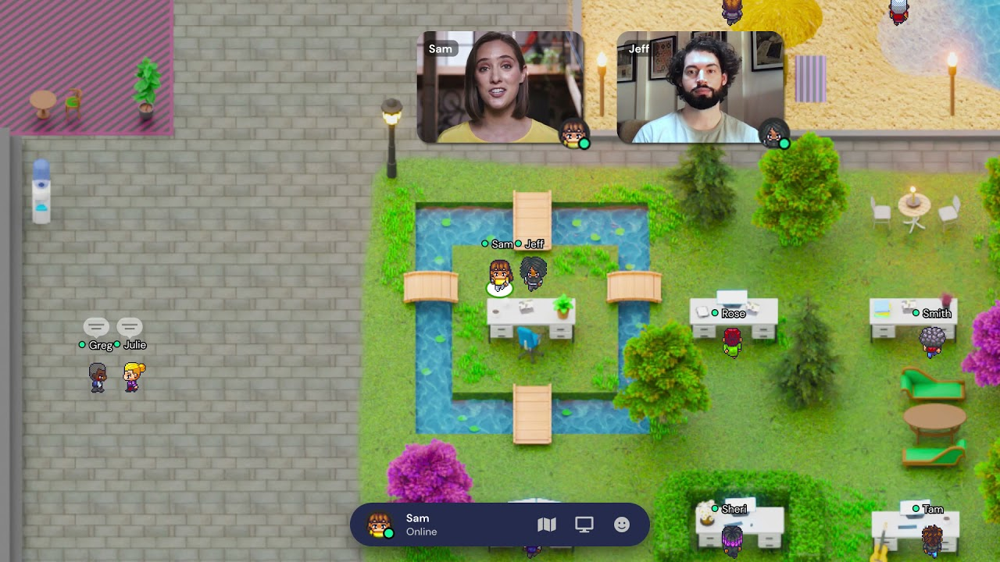
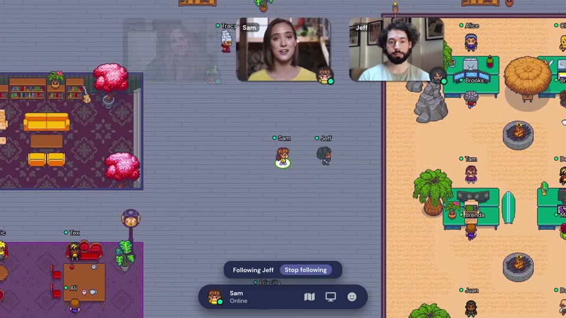
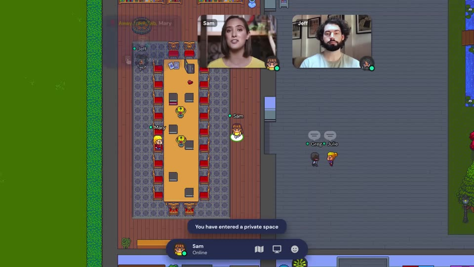
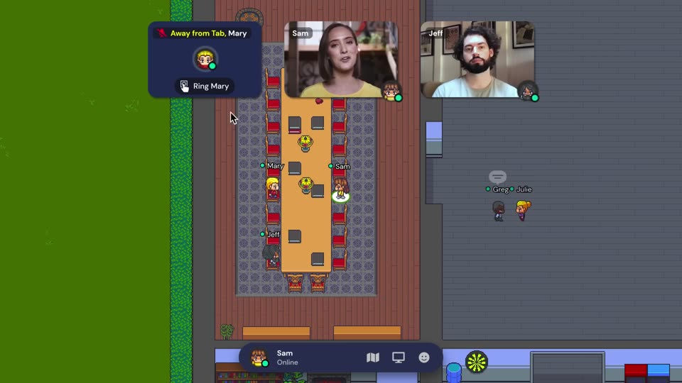
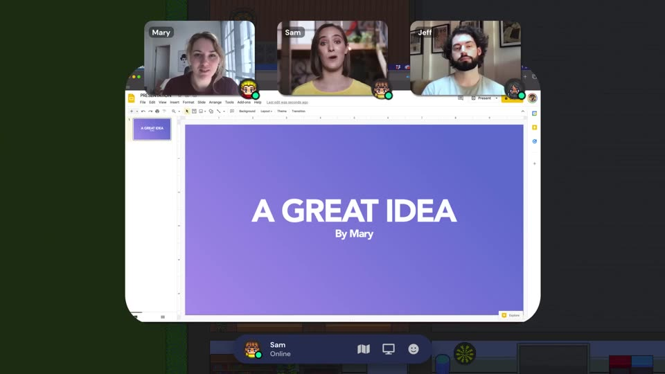
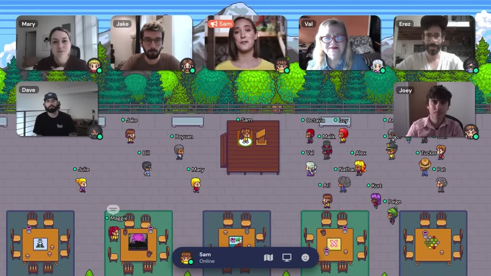
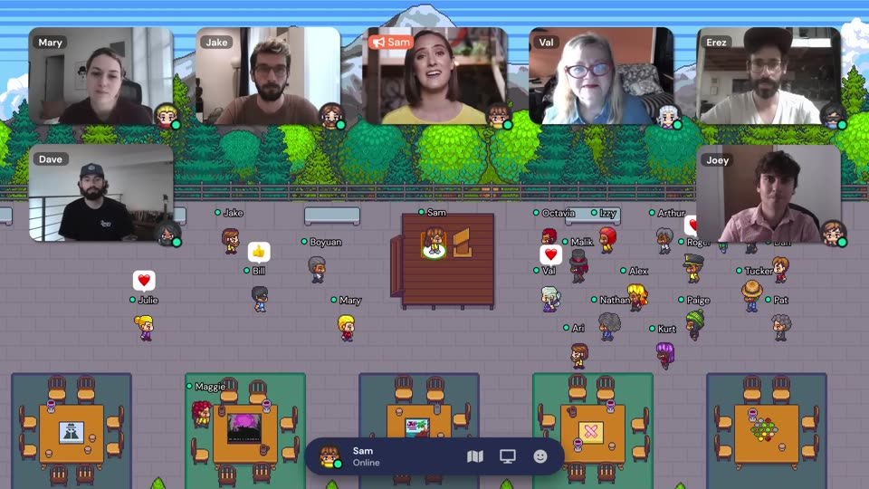

# Plaza — Oficina virtual 2D (MVP)

> **Plaza** es el nombre en clave provisional del producto. Estos documentos planifican
> la primera versión (MVP) de un software de oficina virtual inspirado en
> [Gather Virtual Offices](https://youtu.be/zbllvQZRyh0), con **TypeScript** en frontend y backend.

## Cómo leer esta documentación

Los documentos se escribieron en este orden y cada uno se apoya en los anteriores:

| # | Documento | Qué responde |
|---|-----------|--------------|
| 0 | [Análisis del vídeo](#análisis-del-vídeo-de-referencia) (esta página) | ¿Qué hace el producto de referencia? |
| 1 | [01-brief-requerimiento.md](./01-brief-requerimiento.md) | ¿Qué construimos, para quién y qué entra en el MVP? |
| 2 | [02-arquitectura.md](./02-arquitectura.md) | ¿Cómo se estructura técnicamente? (componentes, protocolos, datos, ADRs) |
| 3 | [03-estandares-codigo.md](./03-estandares-codigo.md) | ¿Cómo escribimos el código? (convenciones, testing, git, CI) |
| 4 | [04-plan-desarrollo.md](./04-plan-desarrollo.md) | ¿En qué orden y en cuánto tiempo? (etapas, sprints, hitos, riesgos) |
| 5 | [historias/](./historias/) | Historias de usuario y tareas técnicas de cada etapa |

### Historias por etapa

| Etapa | Archivo | Resultado demostrable |
|-------|---------|-----------------------|
| E0 | [E0-fundaciones.md](./historias/E0-fundaciones.md) | Monorepo, CI y entorno local; *spike* con LiveKit Cloud |
| E1 | [E1-login-google-perfil.md](./historias/E1-login-google-perfil.md) | "Entrar con Google" y elegir avatar |
| E2 | [E2-espacios-acceso-salas.md](./historias/E2-espacios-acceso-salas.md) | Crear un espacio con sus salas de Google Meet e invitar al equipo |
| E3 | [E3-motor-mapa-2d.md](./historias/E3-motor-mapa-2d.md) | Caminar por el mapa con colisiones y cámara |
| E4 | [E4-multijugador-tiempo-real.md](./historias/E4-multijugador-tiempo-real.md) | Ver a otras personas moverse en tiempo real |
| E5 | [E5-charla-pasillo.md](./historias/E5-charla-pasillo.md) | Acercarse a alguien y hablar por vídeo automáticamente |
| E6 | [E6-salas-reunion-meet.md](./historias/E6-salas-reunion-meet.md) | Entrar en una sala, aislarse del pasillo y unirse a su Google Meet |
| E7 | [E7-presencia-chat-reacciones.md](./historias/E7-presencia-chat-reacciones.md) | Estados con auto-silencio, *ring*, lista de miembros, chat y emojis |
| E8 | [E8-lanzamiento-beta.md](./historias/E8-lanzamiento-beta.md) | Beta privada desplegada y medida |

## Historial de versiones

| Versión | Cambios |
|---|---|
| **2.0** (actual) | Alcance simplificado tras revisar la complejidad: **login solo con Google**; charla de pasillo con **LiveKit Cloud** (sin servidores de medios propios); **salas de reunión con Google Meet** (un Meet permanente por sala, en pestaña nueva) en lugar de salas de medios propias, pantalla compartida y vigilancia de suscripciones; fuera del MVP: escritorios, seguir, *spotlight*, objetos interactivos y chat cercano; algoritmos y herramientas más simples. **242 → 166 puntos, 7 → 5 sprints.** |
| 1.0 | Primera propuesta: identidad propia con contraseña, LiveKit *self-hosted* con áreas privadas garantizadas por el servidor, *spotlight*, pantalla compartida propia y funciones *Should*. Disponible en el historial de git. |

---

## Análisis del vídeo de referencia

**Vídeo:** "Gather Virtual Offices" — canal oficial de Gather — 2 min 23 s, 1080p.
Es un anuncio narrado en primera persona por *Sam*, fundadora de una empresa que trabaja en remoto
("*We missed having a place to work instead of just working from our places*"), que recorre su
oficina en Gather. Transcripción completa con marcas de tiempo: [transcripcion-video.md](./transcripcion-video.md).

### Recorrido escena por escena

| Tiempo | Qué pasa | Función del producto | Captura |
|---|---|---|---|
| 0:00–0:18 | Sam camina desde la entrada (fuente, jardín, puente) hasta la oficina; su vídeo flota sobre el mapa. | Mapa 2D *pixel-art* de vista cenital, avatar con nombre y **cámara que sigue** al avatar; barra inferior con avatar, nombre, estado *Online* y botones de **mapa**, **pantalla** y **emoji**. |  |
| 0:19–0:27 | Se acerca a un objeto resaltado: "*Press X to interact*" y se abre un reproductor ("*The Soundtrack To This Video*"). "Es fácil compartir una web, un calendario, una nota…" | **Objetos interactivos** del mapa que abren contenido incrustado (web, vídeo, nota). |  |
| 0:27–0:37 | Chris se cruza con Sam en el pasillo; su vídeo aparece solo mientras están cerca: "¿Vienes a la *game night*?". | **Vídeo por proximidad** y **encuentros espontáneos**. Los vídeos se desvanecen al alejarse. |  |
| 0:37–0:52 | Sam espera a Jeff en una zona de sofás "*y ve cómo viene de camino*". | **Presencia visible** en el mapa; zona de estar. |  |
| 0:52–1:07 | "Pulso *follow* y Jeff me guía" (aviso "*Following Jeff · Stop following*"). Llegan a su escritorio en una isla con foso de koi. | **Seguir a una persona**; **escritorios personales** con nombre. |  |
| 1:07–1:13 | El mismo mapa cambia de estilo (pixel-art → acuarela → otro). "*Elegir tu estilo es así de fácil.*" | **Estilos/plantillas de mapa** intercambiables. | — |
| 1:13–1:22 | Entran a una sala con mesa larga; aviso "*You have entered a private space*". "Podemos tener una conversación más grande sin molestar a nadie." | **Áreas privadas** (salas de reuniones). Greg y Julie, fuera, muestran un **globo 💬** de "en conversación". |  |
| 1:22–1:30 | Mary está en la sala pero en otra ventana: tarjeta "*Away from Tab, Mary*" con botón "*Ring Mary*". "Gather silencia automáticamente su micro y su cámara." | **Estado automático "fuera de la pestaña"** con **auto-silencio** y **llamar (ring)** a alguien. |  |
| 1:30–1:39 | Mary vuelve y **comparte pantalla** con su presentación ("*A GREAT IDEA*"), que se ve ampliada. | **Compartir pantalla** con vista ampliada. |  |
| 1:39–1:51 | Zona de juegos (futbolín, póker, piscina); Bill trabaja "desde un barco". | Zonas sociales; trabajo desde cualquier lugar. | — |
| 1:51–2:14 | *Game night* en la azotea con ~25 personas. Sam se sube a la tarima: "*Me pongo en el **spotlight tile** para que todos oigan esto*". Aparece un icono de megáfono en su vídeo y la cuadrícula de vídeos de todos. | **Spotlight / difusión** a todo el espacio desde una casilla especial. |  |
| 2:14–2:23 | Lluvia de **reacciones** (❤️ 👍 🎉) sobre los avatares; cierre: "*Te tendremos en tu propio espacio en 30 segundos.*" | **Reacciones con emojis**; **onboarding rapidísimo**. |  |

### Inventario de funciones y decisión para el MVP

| Función observada en el vídeo | Decisión (v2.0) | Requisito |
|---|---|---|
| Mapa 2D, avatares con nombre, movimiento, cámara | ✅ MVP | RF-05, RF-06 |
| Multijugador en tiempo real | ✅ MVP | RF-07 |
| Audio/vídeo por proximidad con desvanecimiento e indicador 💬 | ✅ MVP (LiveKit Cloud) | RF-08, RF-09 |
| Salas privadas + aviso al entrar | ✅ MVP, **con Google Meet** | RF-10 |
| Compartir pantalla con vista ampliada | ✅ MVP, **dentro de Google Meet** | RF-10 |
| Estados + "fuera de la pestaña" con auto-silencio | ✅ MVP | RF-11 |
| Llamar (*ring*) a una persona | ✅ MVP | RF-15 |
| Barra inferior con estado, personas, emoji | ✅ MVP | RF-11, RF-12, RF-14 |
| Reacciones con emojis | ✅ MVP | RF-14 |
| Chat de texto | ✅ MVP (solo chat del espacio) | RF-13 |
| Onboarding en segundos | ✅ MVP (login con Google, meta < 30 s) | RF-01, RF-04, O5 |
| Varios estilos de mapa | ✅ vía plantillas (2) | RF-03 |
| Seguir a una persona | ⏭️ Post-MVP | — |
| Escritorios personales con nombre | ⏭️ Post-MVP | — |
| *Spotlight tile* (hablar a todo el espacio) | ⏭️ Post-MVP | — |
| Objetos interactivos con contenido incrustado | ⏭️ Post-MVP | — |
| Editor de mapas, calendario, grabación e IA propios | ⛔ Fuera (la grabación y transcripción de las salas las da Meet) | — |

### Conclusión del análisis

El mensaje del vídeo es "*echaba de menos la compañía de mi compañía*". El valor está en tres cosas:
**(1)** un espacio persistente donde **ves** a tu equipo, **(2)** la conversación espontánea que se activa
con solo **acercarte**, y **(3)** zonas que imitan la oficina real: salas privadas, escritorios, tarima.
El MVP construye **(1)** y **(2)** —lo que diferencia al producto— y resuelve **(3)** apoyándose en
Google Meet para las salas de reunión, más las funciones de "etiqueta social" que lo hacen usable
(auto-silencio al salir de la pestaña, *ring*, estados, reacciones). Lo demás queda para después.
