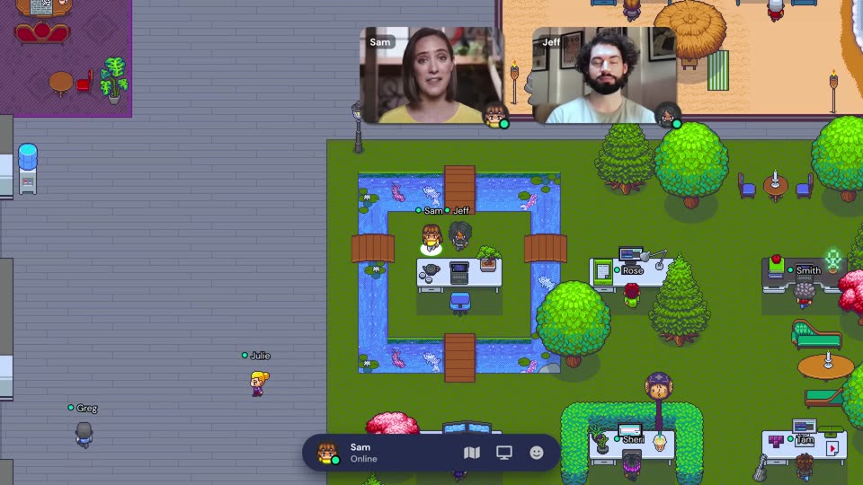
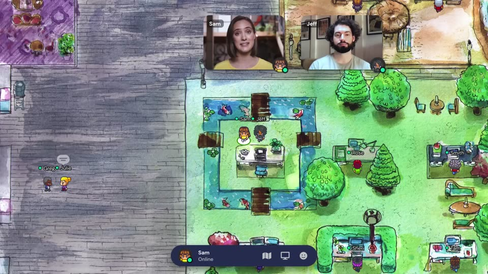
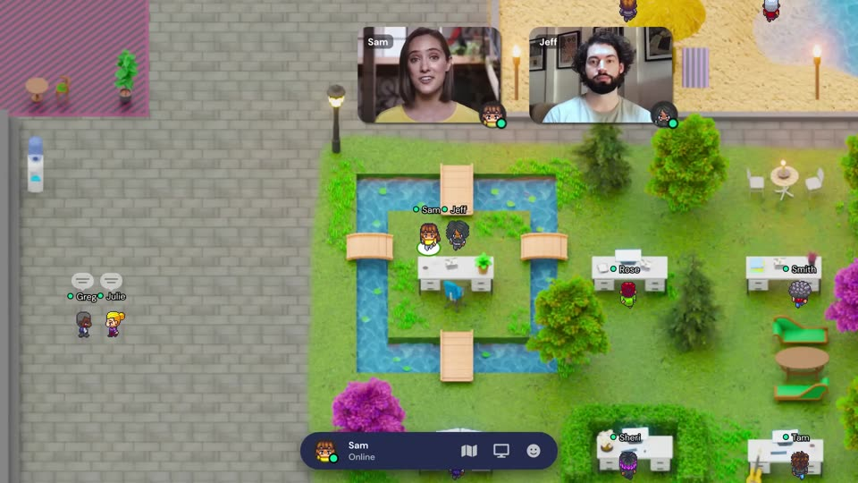

# E9 · Personalización de la oficina

| Campo | Valor |
|---|---|
| Objetivo | Que cada equipo sienta la oficina como suya: elegir el estilo visual del espacio y que cada persona tenga y decore su propio escritorio |
| Depende de | E4 (tiempo real) y E3-S2 (render del mapa por temas) |
| Cubre | RF-16, RF-17, RF-18, RN-13, RN-14, RN-15 |
| Puntos | 15 |
| Sprint | 6 |
| Resultado demostrable | Ana cambia el estilo de la oficina de *pixel art* a acuarela y todos lo ven cambiar en directo; Jeff reclama un escritorio, lo decora con una planta y una lámpara, y al día siguiente aparece directamente en él |

---

## Análisis: la personalización en el vídeo de referencia

Entre 0:49 y 1:13, Sam le pide a Jeff: "*¿nos enseñas tu espacio de trabajo personalizado?*". Jeff la guía
hasta su escritorio y después dice: "*Puede verse así, o así, o incluso así. Elegir tu estilo es así de fácil.*"

| Captura | Qué se ve |
|---|---|
|  | **Espacio personal:** el escritorio de Jeff está en una isla con un estanque de koi, con sus objetos. Los demás escritorios muestran el nombre de su dueño (Rose, Smith, Sheri, Tam). |
|  | **Estilo 1 — *pixel art*.** |
|  | **Estilo 2 — acuarela:** misma distribución, otro arte. |
|  | **Estilo 3 — "maqueta" realista:** misma distribución, otro arte. |

**Conclusiones del análisis**

1. **Hay dos niveles de personalización:**
   - **De la oficina (estilo):** afecta a todo el espacio y lo decide la administración.
   - **Personal (escritorio):** cada persona tiene un sitio propio, con su nombre y sus objetos.
2. **El estilo cambia el arte, no la distribución.** En las tres capturas, el estanque, los puentes, los árboles
   y los escritorios están exactamente en las mismas casillas. Por tanto, un estilo es una **"piel"** sobre la misma
   geometría: colisiones, salas, escritorios y *spawns* no cambian. Eso lo hace barato de implementar.
3. **El cambio es instantáneo y para todos** ("*así de fácil*"): no hay que recargar ni reconstruir el mapa.
4. **El escritorio personal es un punto de referencia social:** sirve para encontrar a alguien ("ven a mi mesa")
   y para expresarse. Mover muebles libremente (un editor de mapas) **no** hace falta para conseguir ese efecto.

## Diseño de la solución

### Estilos (temas) como "pieles" del mapa

- Cada plantilla trae **2 o más estilos** en `packages/maps/templates/<id>/themes/<themeId>/`:
  - `below.png`: todo lo que va por debajo de los avatares (suelo y muebles).
  - `above.png`: lo que va por encima (copas de árboles, marcos de puertas).
  - `thumbnail.png` y `theme.json` (`name`, `author`, `license`).
- Ambas imágenes miden exactamente `ancho × 32` por `alto × 32` px del mapa (máx. 4096 px por lado).
- El `.tmj` sigue siendo la **única fuente de la geometría**. El estilo *pixel* por defecto se genera desde las capas
  de *tiles* con `tmxrasterizer` (incluido con Tiled) en el *build*; los demás estilos son arte pintado sobre esa misma base.
- **Plan B si no hay arte:** un estilo puede ser una **variante de color** del arte por defecto ("Día", "Atardecer",
  "Noche") definida en `theme.json` como una matriz de color que Phaser aplica con un filtro. No necesita ilustradores.
- `Space.themeId` guarda el estilo elegido; `space:snapshot` lo incluye y `space:theme` avisa de los cambios.

### Escritorios

- Nueva capa en Tiled `desks`: rectángulos con `deskId` que coinciden con muebles que ya bloquean el paso
  (las colisiones no cambian). Cada escritorio tiene 3 **huecos de decoración** en posiciones fijas sobre la mesa.
- `Membership.deskId` (único por espacio) y `Membership.deskDecor` (JSON validado con zod:
  `{ slots: [itemId | null, itemId | null, itemId | null] }`).
- Catálogo de **al menos 12 objetos** (planta, lámpara, taza, cuadro, trofeo, gato…) en
  `packages/maps/decor/`, con sprites en todos los estilos, o un sprite neutro que encaje en todos.
- Eventos nuevos: `desk:updated { deskId, userId | null, decor }` (S→C). Solo se envía lo que cambia.

### Cambios en otros documentos

| Documento | Cambio |
|---|---|
| Brief | RF-16, RF-17, RF-18 y RN-13, RN-14, RN-15; los escritorios salen del backlog post-MVP |
| Arquitectura | `Space.themeId`, `Membership.deskId` y `deskDecor`, capa `desks`, carpeta `themes/`, eventos `space:theme` y `desk:updated` |
| E3-S2 | El mapa se dibuja desde las imágenes del estilo (sin puntos extra) |

---

### E9-S1 · Estilos de la oficina con cambio en directo — 5 pts

**Como** administradora **quiero** elegir el estilo visual de mi oficina entre varios **para** que el espacio encaje con la identidad de mi equipo, como en el vídeo ("*elegir tu estilo es así de fácil*").

**Criterios de aceptación**
- **Dado** los ajustes del espacio, **cuando** abro "Estilo", **entonces** veo las miniaturas de los estilos de mi plantilla (mínimo 2).
- **Dado** que soy *owner* y elijo otro estilo, **cuando** confirmo, **entonces** todos los conectados ven el cambio en < 2 s con un fundido, sin recargar y sin que nadie cambie de posición.
- **Dado** que soy *member*, **cuando** abro los ajustes, **entonces** veo el estilo actual pero no puedo cambiarlo (`403` si lo intento por API).
- **Dado** un estilo nuevo, **cuando** alguien entra al espacio más tarde, **entonces** carga directamente ese estilo.
- **Dado** un estilo cuyas imágenes no coinciden con el tamaño del mapa o sin licencia declarada, **cuando** corre `pnpm validate:maps`, **entonces** falla.
- Las colisiones, salas y escritorios funcionan igual en todos los estilos (test E2E: caminar el mismo recorrido en dos estilos).

**Tareas técnicas**
- [ ] `PATCH /api/spaces/:spaceId { themeId }` (solo *owner*) → difunde `space:theme { themeId }`.
- [ ] `ThemeLoader` en Phaser: carga las nuevas imágenes y las cambia con un fundido; libera las texturas anteriores.
- [ ] Script de *build* que genera el estilo *pixel* con `tmxrasterizer` y comprueba tamaños.
- [ ] Soporte de estilos de "variante de color" (matriz en `theme.json`) como plan B.

---

### E9-S2 · Mi escritorio: reclamar, asignar y aparecer en él — 5 pts

**Como** miembro **quiero** tener un escritorio propio con mi nombre **para** que me encuentren fácilmente y sentir que tengo un sitio en la oficina.

**Criterios de aceptación**
- **Dado** un escritorio libre, **cuando** me acerco y pulso `X` → "Reclamar este escritorio", **entonces** pasa a ser mío y mi nombre aparece sobre él para todos.
- **Dado** que ya tengo escritorio, **cuando** reclamo otro, **entonces** se me pide confirmar el cambio y el anterior queda libre (RN-13).
- **Dado** que soy *owner*, **cuando** asigno o libero el escritorio de otra persona desde "Miembros", **entonces** el cambio se ve en directo (RN-14).
- **Dado** que tengo escritorio, **cuando** entro al espacio, **entonces** aparezco junto a él en vez de en un *spawn*.
- **Dado** el botón "Mi escritorio" de la barra inferior, **cuando** lo pulso, **entonces** mi avatar vuelve junto a mi escritorio (el servidor lo valida como un *spawn*).
- **Dado** la lista de miembros, **cuando** pulso "Ir a su escritorio", **entonces** la cámara me muestra su escritorio (reutiliza "Localizar").
- **Dado** que expulsan a alguien o borra su cuenta, **cuando** ocurre, **entonces** su escritorio queda libre.

**Tareas técnicas**
- [ ] Capa `desks` en `parseMap` y en `validate:maps` (cada `deskId` único y sobre casillas no transitables).
- [ ] `PUT/DELETE /api/spaces/:spaceId/desks/:deskId` con restricción única `(spaceId, deskId)`; evento `desk:updated`.
- [ ] Etiqueta del nombre sobre el escritorio en Phaser; "Mi escritorio" en la `BottomBar`.

---

### E9-S3 · Decorar mi escritorio — 5 pts

**Como** miembro **quiero** poner objetos en mi escritorio **para** darle mi toque personal (como el espacio de Jeff en el vídeo).

**Criterios de aceptación**
- **Dado** mi escritorio, **cuando** pulso `X` → "Decorar", **entonces** se abre un panel con el catálogo (≥ 12 objetos) y los 3 huecos de mi mesa con vista previa en directo.
- **Dado** que coloco una planta en el hueco 1 y guardo, **cuando** se aplica, **entonces** todos la ven en < 1 s y sigue allí al día siguiente.
- **Dado** que cambio el estilo de la oficina, **cuando** se aplica, **entonces** mis objetos siguen en su sitio y se ven bien en el nuevo estilo.
- **Dado** un `itemId` que no está en el catálogo o más de 3 objetos, **cuando** llega al servidor, **entonces** se rechaza (`400`) (RN-15).
- **Dado** que no es mi escritorio, **cuando** intento decorarlo, **entonces** no aparece la opción (y la API responde `403`).
- El panel se usa con teclado y cada objeto tiene nombre accesible.

**Tareas técnicas**
- [ ] Catálogo `packages/maps/decor/manifest.json` (id, nombre i18n, sprite) con licencias CC0.
- [ ] `PATCH /api/spaces/:spaceId/desks/:deskId/decor` con validación zod; `desk:updated` con la decoración.
- [ ] `DeskDecorPanel` (React) y `DeskDecorLayer` (Phaser) que dibuja los objetos en los huecos.
